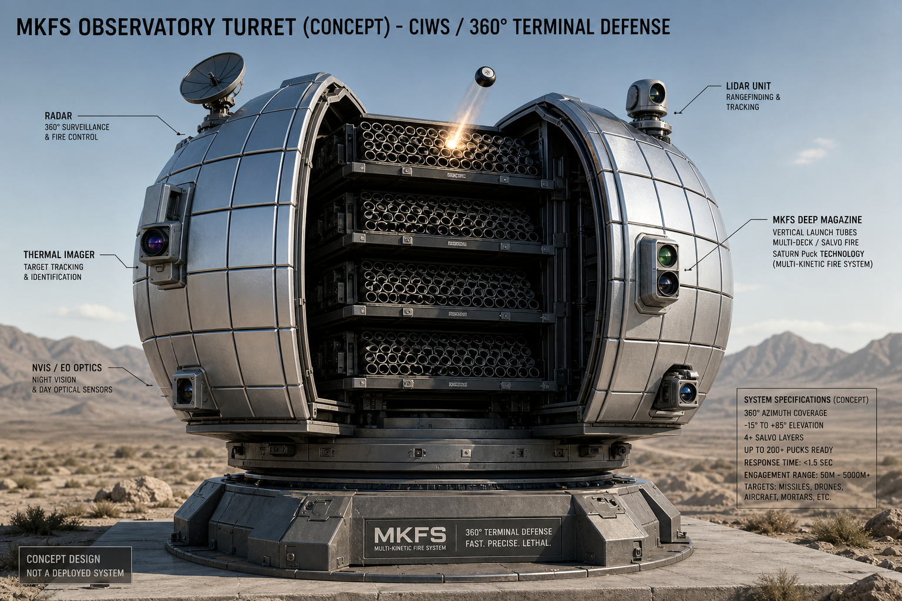
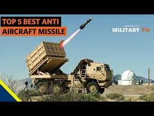
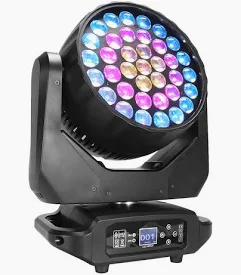
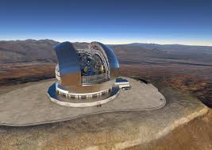

# MFKS — Modular Flechette Kinetic System (MKFS)

**Repository:** [github.com/FratresMedAI/MFKS-Kinetic-Cloud](https://github.com/FratresMedAI/MFKS-Kinetic-Cloud)

Last-ditch kinetic defense. Two packaging lines:

| Package | Form | Module size |
|---------|------|-------------|
| **Appliqué strips** | Flat on Stryker/JLTV/ship skin | **2×1 ft** / **3×1 ft** |
| **Pan-tilt turret** | **Moving head + yoke** (like stage light) | **2×2 ft** magazine inside head |

→ [assets/](assets/) · [DESIGN_PHILOSOPHY.md](docs/DESIGN_PHILOSOPHY.md)

## Concept renders

### Appliqué mounts — Stryker, JLTV, USV

→ [MOUNTING_CONCEPT.md](assets/MOUNTING_CONCEPT.md)

### Standalone 6×6 support vehicle

→ [STANDALONE_SUPPORT_VEHICLE.md](assets/STANDALONE_SUPPORT_VEHICLE.md)

### Pan-tilt turret — moving head form, 2×2 ft magazine inside

→ [OBSERVATORY_TURRET.md](assets/OBSERVATORY_TURRET.md)

### Early observatory building concept *(superseded by moving-head turret above)*

## Reference images

| Reference | Preview |
|-----------|---------|
| Tube battery layout |  |
| HIMARS / MLRS launcher |  |
| Stage light pan/tilt form |  |
| Observatory dome opening |  |

## Disclaimer

Concept documentation only.
