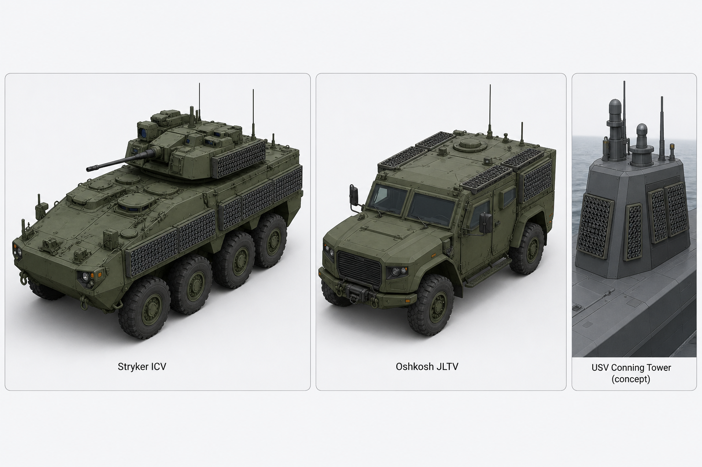
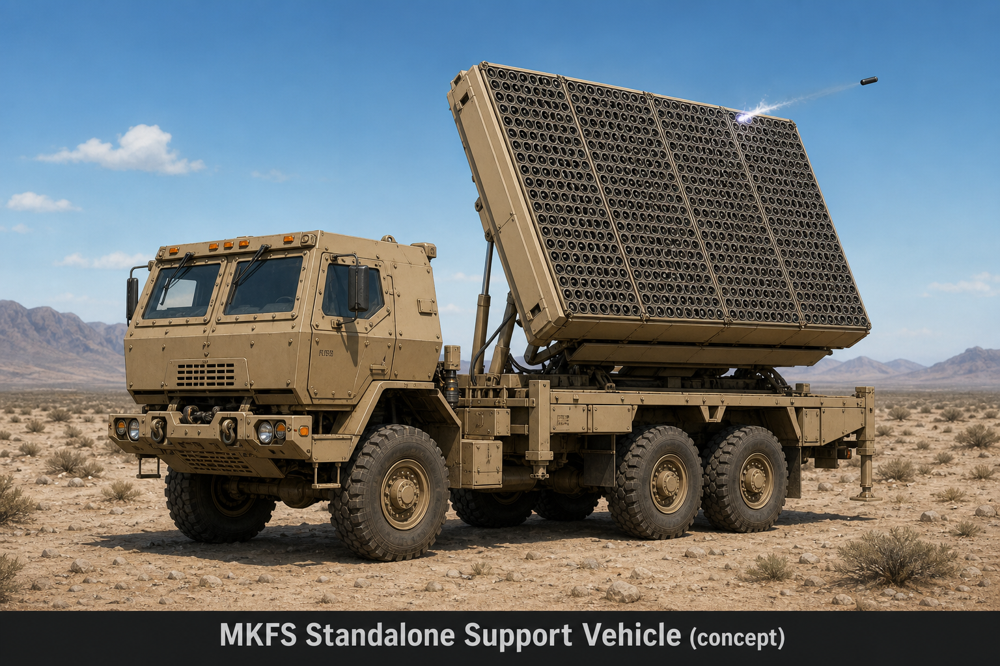
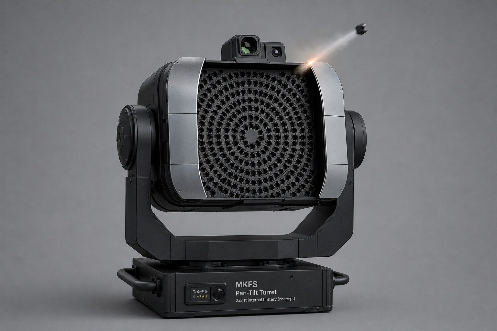

# MFKS — Modular Flechette Kinetic System (MKFS)

**Repository:** [github.com/FratresMedAI/MFKS-Kinetic-Cloud](https://github.com/FratresMedAI/MFKS-Kinetic-Cloud)

Last-ditch kinetic defense. Two packaging lines:

| Package | Form | Module size |
|---------|------|-------------|
| **Appliqué strips** | Flat on Stryker/JLTV/ship skin | **2×1 ft** / **3×1 ft** |
| **Pan-tilt turret** | **Moving head + yoke** (like stage light) | **2×2 ft** magazine inside head |

→ [assets/](assets/) · [DESIGN_PHILOSOPHY.md](docs/DESIGN_PHILOSOPHY.md)

## Concept renders

| Image | Link |
|-------|------|
| Appliqué mounts (Stryker/JLTV/USV) | [mkfs_mounting_concept_stryker_jltv_usv.png](assets/mkfs_mounting_concept_stryker_jltv_usv.png) |
| Standalone 6×6 support truck | [mkfs_standalone_support_vehicle.png](assets/mkfs_standalone_support_vehicle.png) |
| Moving-head pan-tilt turret (2×2 ft) | [mkfs_moving_head_turret_2x2.png](assets/mkfs_moving_head_turret_2x2.png) |
| Puck design comparison (PUCK-A / PUCK-B) | [mkfs_puck_design_comparison_4up.png](assets/mkfs_puck_design_comparison_4up.png) |
| Puck cutaway storyboard (6-up) | [mkfs_puck_storyboard_6up.png](assets/mkfs_puck_storyboard_6up.png) |

### Appliqué mounts (Stryker/JLTV/USV)

### Standalone 6×6 support truck

### Moving-head pan-tilt turret (2×2 ft)

### Puck forms & cutaway storyboard

→ [PUCK_CUTAWAY_STORYBOARD.md](docs/visual/PUCK_CUTAWAY_STORYBOARD.md) · [PUCK_DESIGN_OPTIONS.md](assets/PUCK_DESIGN_OPTIONS.md)

## Concept & Outreach *(Phase 5)*

| Topic | Doc |
|-------|-----|
| Salvo recalibration (136/208/289 tubes) | [SALVO_SCENARIOS.md](research/ballistics/SALVO_SCENARIOS.md) |
| Magazine economics | [MAGAZINE_ECONOMICS.md](docs/MAGAZINE_ECONOMICS.md) |
| Threat vignettes | [CONOPS_VIGNETTES.md](docs/CONOPS_VIGNETTES.md) |
| Fratricide & deconfliction | [FRATRICIDE_DECONFLICTION.md](docs/FRATRICIDE_DECONFLICTION.md) |
| Competitive positioning | [COMPETITIVE_POSITIONING.md](docs/COMPETITIVE_POSITIONING.md) |
| Maritime & fixed-site | [MARITIME_FIXED_SITE.md](docs/MARITIME_FIXED_SITE.md) |
| Swarm test concept (T5) | [SWARM_TEST_CONCEPT.md](docs/SWARM_TEST_CONCEPT.md) |
| **Network & C2 architecture** | [NETWORK_ARCHITECTURE.md](docs/NETWORK_ARCHITECTURE.md) — *250 ms @ 60 mph → 22 ft miss; local predictor required (`pattern_overlap_with_predictor` ≥ 0.70)* |
| ITAR / export framing | [ITAR_EXPORT_FRAMING.md](docs/ITAR_EXPORT_FRAMING.md) |
| Puck cutaway storyboard | [PUCK_CUTAWAY_STORYBOARD.md](docs/visual/PUCK_CUTAWAY_STORYBOARD.md) |
| Reload under fire | [RELOAD_UNDER_FIRE.md](docs/visual/RELOAD_UNDER_FIRE.md) |
| One-pager | [ONE_PAGER.md](docs/outreach/ONE_PAGER.md) |
| Pitch deck | [PITCH_DECK.md](docs/outreach/PITCH_DECK.md) |
| Questions for primes | [QUESTIONS_FOR_PRIMES.md](docs/outreach/QUESTIONS_FOR_PRIMES.md) |
| Contributing | [CONTRIBUTING.md](CONTRIBUTING.md) · [COLLABORATION_CHARTER.md](docs/COLLABORATION_CHARTER.md) |
| **Core enhancements** *(terminal focus)* | [MKFS_CORE_ENHANCEMENTS.md](docs/MKFS_CORE_ENHANCEMENTS.md) |
| Drone radar + EM *(terminal cueing)* | [ICD_DRONE_RADAR.md](docs/ICD_DRONE_RADAR.md) |

## License

Licensed under **[Apache License 2.0](LICENSE)** — industry-friendly open terms with an explicit patent grant.

Contributions and collaboration welcome (issues, pull requests, or direct outreach). Defense primes, integrators, and research partners can fork, extend, and build on this work under the license terms.

→ [LICENSE](LICENSE) · [NOTICE](NOTICE)

## Disclaimer

Concept documentation only. Not an engineering specification, procurement offer, or export-controlled deliverable.
