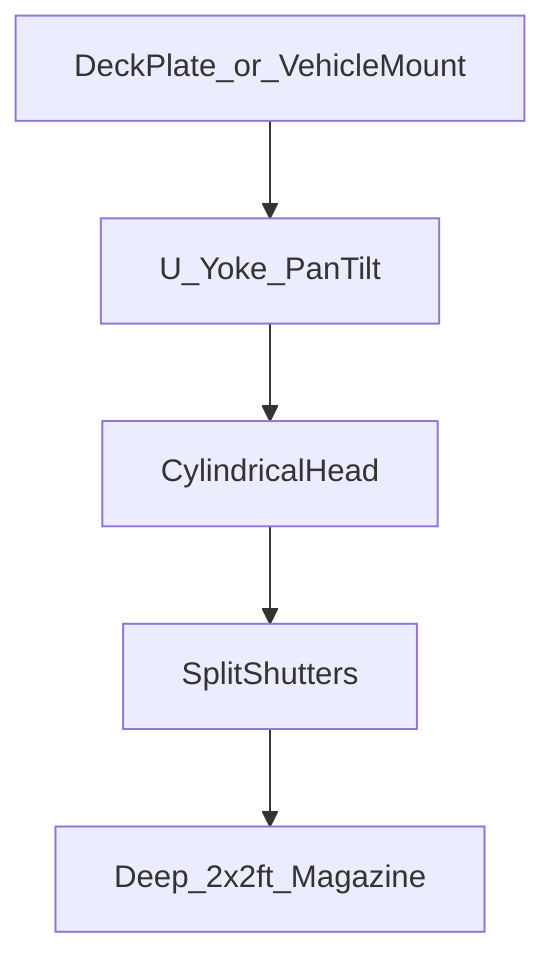

# MKFS Pan-Tilt Turret — “Lethal Moving Head”

**Asset:** [mkfs_moving_head_turret_2x2.png](mkfs_moving_head_turret_2x2.png)  
**Form reference:** [reference_moving_head_stage_light.png](reference_moving_head_stage_light.png)  
**Opening reference:** [reference_observatory_dome_opening.png](reference_observatory_dome_opening.png)  
**Related:** [DESIGN_PHILOSOPHY.md](../docs/DESIGN_PHILOSOPHY.md) | [PUCK_RELEASE.md](../docs/PUCK_RELEASE.md)

---

## THIS Is the Shape

**Not** a mountain observatory building. **Not** a huge launcher on a concrete pad.

**Like a moving-head stage light:**

| Stage light | MKFS turret |
|-------------|-------------|
| Compact cylindrical **head** | **2×2 ft** weapon head |
| **U-yoke** — pan + tilt | **360° pan**, elevation tilt |
| Dense **ring grid** on front face | Dense **puck tube grid** (~289 tubes) |
| Small **base** / handles | Vehicle deck plate or FOB mount |
| Looks like lighting rig | Looks like sensor pod — **until it opens** |

**Plus:** observatory **split shutters** on the head peel apart → reveal the **2×2 ft deep puck battery** inside.

**Lethal Rubik’s cube** = compact moving head that **eviscerates the sky**.

---

## Head — **2 ft × 2 ft**

The launcher face inside the head is **always 2×2 ft** (610 × 610 mm):

| Parameter | Value |
|-----------|-------|
| Front face | **2 ft × 2 ft** square tube grid |
| Tube count | **~289** (17×17 @ 35 mm pitch) |
| Depth | **Multi-salvo stack** — 3–4× **2×2 ft decks** inside the head |
| Outer head | Slightly larger than 2×2 — room for shutters + sensors |

```
  Front view (shutters open)

      ╱ shutter ╲
     │ ○ ○ ○ ○ ○ │  ← 2×2 ft tube grid
     │ ○ ○ ○ ○ ○ │     ~289 mouths
     │ ○ ○ ○ ○ ○ │     (like LED rings on stage light)
      ╲ shutter ╱
```

---

## Mechanism



| Part | Function |
|------|----------|
| **Base plate** | Bolts to MRAP roof, ship deck, FOB pad |
| **U-yoke** | Pan **360°** · tilt **-10° to +70°** |
| **Head** | Compact drum — housing + shutters |
| **Shutters** | Observatory-style split panels — slide open |
| **Magazine** | Stacked **2×2 ft** salvo decks (3–4 deep) |
| **Sensors** | Radar, lidar, thermal, NVIS on head skin |

---

## Engagement

1. Sensors cue threat bearing  
2. Yoke **pans + tilts** to solution  
3. Shutters **open** (observatory peel)  
4. FCU **`LAST_DITCH_FULL`** — 289 tubes × deck, electronic select  
5. Next salvo deck indexes — repeat  

---

## vs. Other MKFS Packaging

| Package | Form | Launcher face |
|---------|------|---------------|
| Appliqué strip | Flat on armor | **2×1 / 3×1 ft** strips |
| Support truck | Tilt bed | Linked strips |
| **Pan-tilt turret** | **Moving head + yoke** | **2×2 ft** stacked inside head |

**Only the observatory / pan-tilt turret uses the 2×2 ft square magazine** — the CIWS cube.

**Designator:** `MKFS-TUR-PT-2x2`

---

## Disclaimer

Concept render. Head dimensions, yoke load, and deck count require engineering validation.
