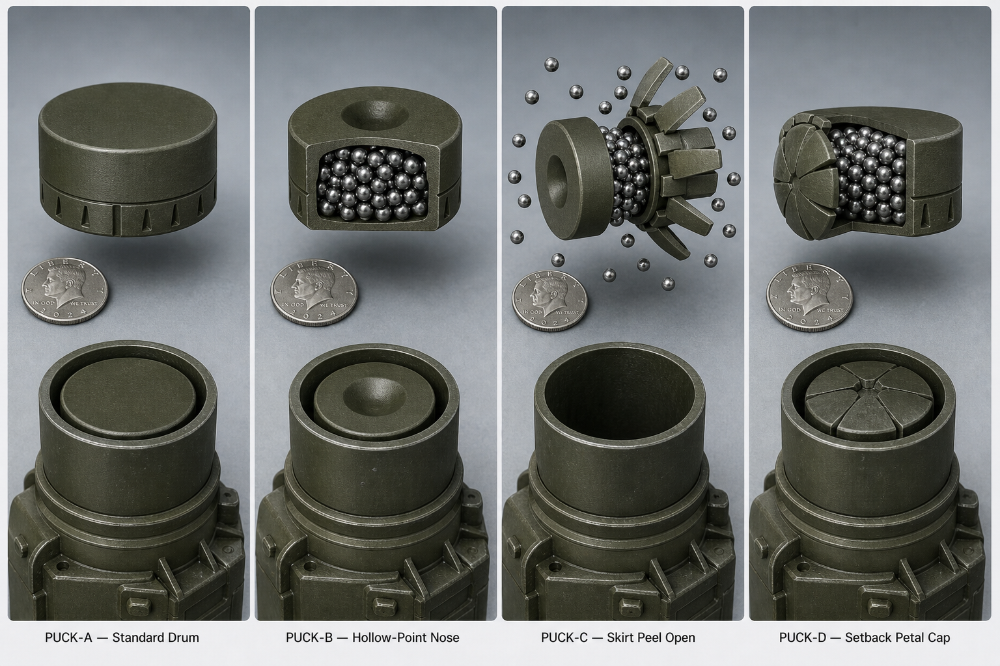

# MKFS Puck Design — Canonical Forms

**Asset:** [mkfs_puck_design_comparison_4up.png](mkfs_puck_design_comparison_4up.png)  
**Document ID:** MKFS-VIS-PUCK-001  
**Decision:** D-011  
**Related:** [CARRIER_PROJECTILE_ICD.md](../docs/CARRIER_PROJECTILE_ICD.md) | [PUCK_RELEASE.md](../docs/PUCK_RELEASE.md) | [PUCK_CUTAWAY_STORYBOARD.md](../docs/visual/PUCK_CUTAWAY_STORYBOARD.md)

---

## Render

Four **hockey-puck disc** concepts (31 mm × 28 mm per ICD). Quarter shown for scale. **Not shells. Not bullets.**

---

## Canonical Forms — Selected (D-011)

| Option | Name | Role | Use everywhere |
|--------|------|------|----------------|
| **A** | **Standard Drum** | Closed short cylinder, scored skirt band at base, flat top | **Canonical** — tube fill, tile packing, general ICD diagrams |
| **B** | **Hollow-Point Nose** | Domed hollow-point face + titanium BBs visible in cutaway | **Canonical** — peel doctrine, storyboards, release sequence |

**Payload (A + B):** ~40 **titanium BBs** (Ti-6Al-4V), 00-buck class spread — kinetic only, no HE.

---

## Reference Only (Not Canonical)

| Option | Name | Notes |
|--------|------|-------|
| **C** | Skirt Peel Open | Action shot — useful for one-off marketing; use B for static cutaways |
| **D** | Setback Petal Cap | Mechanism reference only; form B preferred for visuals |

---

## Revision History

| Version | Date | Change |
|---------|------|--------|
| 0.1 | 2026-05-22 | Four-up puck design comparison render |
| 0.2 | 2026-05-22 | D-011 — PUCK-A + PUCK-B locked as canonical |
