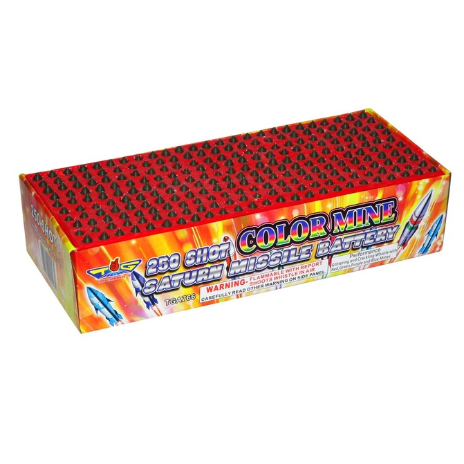

# MKFS Design Philosophy — Last-Ditch Terminal Defense

**Document ID:** MKFS-DOC-PHIL-001  
**Version:** 0.4  
**Status:** Authoritative design intent

> **Two module sizes — different packages**  
> - **Vehicle appliqué / strips:** **2×1 ft** and **3×1 ft** tiles on armor  
> - **Pan-tilt turret (moving head):** **2×2 ft** square magazine **inside the head** — stacked deep  

---

## 1. What MKFS Is (and Is Not)

MKFS is a **last-ditch, don’t-die defensive layer** — the same *role* as **CIWS** and hard-kill APS, but **kinetic-only** and aimed at **close-in drone swarms**.

**Original packaging idea:** a **“lethal moving head”** — compact pan/tilt turret (like a stage light) with observatory shutters that open to reveal a **deep 2×2 ft puck magazine** inside. See [OBSERVATORY_TURRET.md](../assets/OBSERVATORY_TURRET.md).

| Analogue | Threat | Mechanism |
|----------|--------|-----------|
| **CIWS / Phalanx** | Missiles, aircraft | Gatling + radar |
| Trophy / APS | RPG, ATGM | Explosive intercept |
| **MKFS** | Drone swarm | **Kinetic puck clouds** — no explosives |
| **MKFS pan-tilt turret** | Swarm, 360° | **Moving-head yoke → shutters open → 2×2 ft stack → rip** |

This is **not** primary air defense. It is what the crew fires when the swarm is already close, other systems failed or weren’t there, and the vehicle **cannot afford to die**. Volume and speed matter more than elegance.

---

## 2. Form Factor — Flat Tube Battery (Visual Reference)

**This is the shape.** Think of a consumer **multi-shot tube battery** — a flat rectangle with a **dense grid of launch tubes** seen from the top — but:

| Firework reference | MKFS |
|--------------------|------|
| ~250 tiny rockets in a flat box | **~289 half-dollar pucks** in one **2×2 ft** box |
| Sequential fuse | **Electronic per-tube fire** — pick sector or dump all |
| Explosive / pyrotechnic | **Kinetic only** — no explosives in the round |
| Party toy | **Last-ditch vehicle defense** — don’t die |



*Reference photo: commercial tube battery layout. MKFS uses the **same physical idea** — low flat panel, grid of tubes — with military puck rounds and electronic initiation.*

### Vehicle strips — `2×1 ft` / `3×1 ft`

Flat appliqué tiles on turret cheeks, hull, roof — see [ARRAY_MODULE_SPEC.md](../prototypes/array/ARRAY_MODULE_SPEC.md).

| Tile | Face | Tubes *(approx.)* |
|------|------|-------------------|
| **2×1 ft** | 610 × 305 mm | ~136 |
| **3×1 ft** | 915 × 305 mm | ~208 |

### Pan-tilt turret — **`2×2 ft` inside the head**

**Like a moving-head stage light** — U-yoke, 360° pan, compact cylindrical head.

| | |
|--|--|
| **Inside face** | **2 ft × 2 ft** (610 × 610 mm) |
| **Tubes per deck** | **~289** (17×17 grid) |
| **Depth** | 3–4 salvo decks stacked — observatory shutters peel open to fire |

**Only the turret uses 2×2 ft.** Vehicles use 2×1 / 3×1 strips.

---

## 3. Scale — Why Electronic Firing Is Non-Negotiable

Tube count is **not** capped at 25 or 36. The architecture must support:

- One **2×2 ft** box on a recon cheek  
- Two **2×2 ft** boxes on a Stryker bustle + hull  
- Observatory turret: **stacked 2×2 ft decks** — multiple salvos, same face size  
- Link multiple **2×2 ft** boxes for bigger platforms

You cannot do that with dumb ripple fire and one fuse line. **Every tube is individually addressable** by the FCU:

- Fire one tube  
- Fire a sector (e.g. left 30 tubes)  
- Fire full **“don’t die”** dump — everything at once or in a programmed ripple  

**Electronic initiation at the launcher is the core technology.** The round itself stays dumb and mechanical.

---

## 4. Projectile — Hollow-Point Puck

**CIWS + 30 mm caliber + hockey puck + 00 buck + hollow-point opening** — one strip. See [PUCK_RELEASE.md](PUCK_RELEASE.md).

Projectiles are **short pucks** (~31 mm × ~28 mm) — half-dollar **width**, grenade **caliber**, puck **depth**. They **open like a hollow point**: skirt peels, **speed and drag spread the cloud** — no HE, no electronic fuze.

| Reference | Size vs MKFS puck |
|-----------|-------------------|
| Half dollar | Same **diameter** (~31 mm); puck is **thicker** (28 mm vs 2 mm coin) |
| 30×113 mm grenade | Same **caliber**; puck is **~¼ the length** |
| 00 buckshot | **35–45 sub-projectiles per puck** — strip = thousands |

| MKFS puck (design target) | Value |
|-----------------------------|-------|
| Diameter | 31 mm |
| Length | ~28 mm |
| Release | Hollow-point skirt peel @ `R_open` |
| Sub-projectiles | **~40 titanium BBs** / puck |
| Full **2×2 ft** box | ~289 pucks → **~11,500+** sub-projectiles |

**Terminal goal:** full strip dump **saturates a volume of sky** (~200–500 ft deep, wide merged cone) — “eviscerate the swarm” in the last-ditch window.

---

## 5. Mounting Philosophy

**Lay on, don’t bolt up a tower.**

| Surface | Example | Layout |
|---------|---------|--------|
| Turret cheek | Bradley | **2×2 ft** box per side |
| Turret bustle | Stryker | **2×2 ft** box |
| Hull side | M113 | **2×2 ft** box (or two linked) |
| Observatory turret | CIWS cube | **Stacked 2×2 ft decks** inside dome |
| Support truck | Escort | 1–2× **2×2 ft** on tilt bed |

Adapter kits are **thin backing plates + cable run** — same tile bolts to turret cheek or hull side using **MKFS-IF-003**.

Dual (or multi) tile placement still gives **360°** coverage; geometry is per-vehicle, not “always two roof boxes.”

---

## 6. Engagement Doctrine

1. **Primary systems** (if any) engage farther out.  
2. Swarm leaks inside ~500 yd.  
3. MKFS is cleared — **terminal volume fire** into the approach corridor.  
4. Goal: **kill enough drones in the volume** that the vehicle survives the pass — not perfect single-shot kills.

FCU presets:

| Preset | Behavior |
|--------|----------|
| `LAST_DITCH_FULL` | All tubes, minimum delay — **saturate the sky — survive now** |
| `SECTOR_LEFT` / `SECTOR_RIGHT` | Addressed tubes only — friendly side clear |
| `RIPPLE_50MS` | Programmed ripple — balance heat & coverage |
| `HOLD` | Safe — no fire |

---

## 7. Symmetry & Modularity Rules

1. **One puck family** (`MKFS-CART-PUCK`) — all tiles, all vehicles.  
2. **One tile edge interface** — any tile connects to any tile (MKFS-IF-002).  
3. **One adapter plate family** — vehicle-specific only in the backing curve/plate.  
4. **Scale by tile count**, not by redesigning the projectile.  

```
  Example: two 2×2 ft boxes on a hull face

  [  2×2 ft  ][  2×2 ft  ]   ← ~578 tubes total

  Observatory: same 2×2 ft face, stacked 3–4 deep = multiple salvos
```

---

## 8. Relation to Prior Documentation

| Old concept | Updated concept |
|-------------|-----------------|
| Wrong turn (2×1 / 3×1 strips) | **2×2 ft box** — always |
| 165 mm “rifle” cartridge | **31 mm × ~30 mm puck** |
| Roof dual-array only | **Turret, hull, roof** — any face |
| “Terminal defense” (generic) | **Last-ditch / don’t-die** — APS analogue |

See [ARRAY_MODULE_SPEC.md](../prototypes/array/ARRAY_MODULE_SPEC.md), [CARRIER_PROJECTILE_ICD.md](CARRIER_PROJECTILE_ICD.md), [VEHICLE_INTEGRATION.md](VEHICLE_INTEGRATION.md).

**Phase 5 concept docs:** [SALVO_SCENARIOS.md](../research/ballistics/SALVO_SCENARIOS.md) · [CONOPS_VIGNETTES.md](CONOPS_VIGNETTES.md) · [MKFS_CORE_ENHANCEMENTS.md](MKFS_CORE_ENHANCEMENTS.md) · [ICD_DRONE_RADAR.md](ICD_DRONE_RADAR.md)

---

## 9. Revision History

| Version | Date | Change |
|---------|------|--------|
| 0.1 | 2026-05-22 | Initial (Phase 0) |
| 0.3 | 2026-05-22 | Saturn battery reference, CIWS turret |
| 0.4 | 2026-05-22 | **Restored 2×2 ft as sole standard module** (~289 tubes) |
| 0.5 | 2026-05-22 | Phase 5 cross-links — salvo scenarios, CONOPS, collab |
