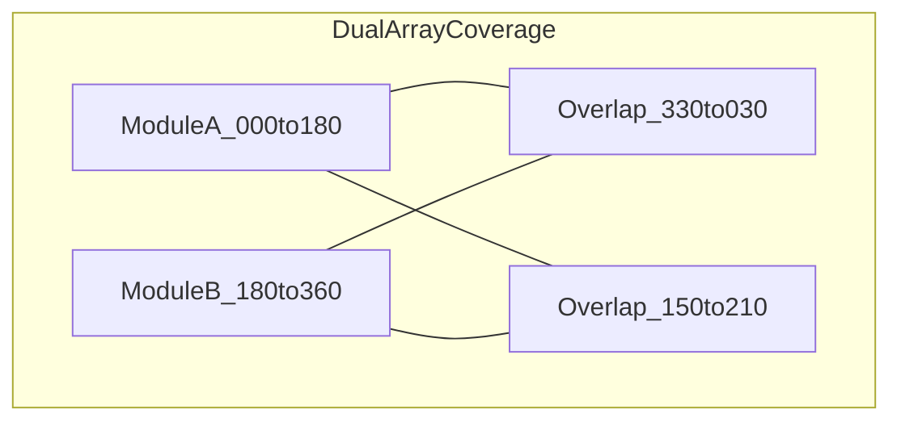

# MKFS Dual-Array Fire Plans

**Status:** Concept | Phase 9
**Purpose:** Per-platform dual-array fire allocation.
**Key Decisions:** See [DECISIONS.md](DECISIONS.md)
**Open Questions:** See [RISK_REGISTER.md](RISK_REGISTER.md)

**Document ID:** MKFS-DOC-FIRE-001  
**Version:** 0.1 (Phase 3)  
**Related:** [VEHICLE_INTEGRATION.md](VEHICLE_INTEGRATION.md) | [adapters/README.md](adapters/README.md) | [FCU_STATE_MACHINE.md](../src/fire_control/FCU_STATE_MACHINE.md)

---

## 1. Purpose

Define dual-array coverage geometry, overlap zones, and FCU fire allocation per platform for 360° terminal defense.

---

## 2. Coverage Model

Each array module covers ~180° azimuth with ±15°–25° overlap at quarters relative to vehicle bow (000°).



---

## 3. Platform Fire Plans

### 3.1 Stryker ICV/CV

| Module | Mount | Arc (bow-relative) | Overlap Partner |
|--------|-------|-------------------|-----------------|
| A (FWD) | Fore roof | 330°–150° | B at 330°–030° and 120°–150° |
| B (AFT) | Aft roof | 150°–330° | A at 150°–210° and 300°–330° |

**Threat allocation:** FCU selects primary module by threat azimuth; secondary module fires if threat in overlap or salvo density required.

| Threat Azimuth | Primary | Secondary | Profile |
|----------------|---------|-----------|---------|
| 000°–045° | A | B (overlap) | SWARM_FOCUS |
| 045°–135° | A | — | SWARM_WIDE |
| 135°–225° | B | A (overlap) | SWARM_WIDE |
| 225°–315° | B | — | SWARM_WIDE |
| Full surround | A + B | Simultaneous | SWARM_BURST |

---

### 3.2 M2 Bradley

| Module | Arc | Notes |
|--------|-----|-------|
| Forward | 330°–150° | +15° default elevation |
| Aft | 150°–330° | Engine deck vibration — shock isolated |

TOW arc dead zone: 090°–120° elevated — FCU inhibits unless manual override.

---

### 3.3 M113

| Module | Arc | Notes |
|--------|-----|-------|
| Port | 270°–090° | Compact tier |
| Starboard | 090°–270° | Overlap at bow/stern ±25° |

Lower salvo count — prefer SWARM_FOCUS over SWARM_WIDE.

---

### 3.4 LAV-25

| Module | Arc | Notes |
|--------|-----|-------|
| Forward | 000°–180° | Stow mode disables A |
| Aft | 180°–360° | Stow mode disables B |

Amphibious ops: single-module coverage only (operational module per mission brief).

---

### 3.5 MRAP (MaxxPro Dense)

| Module | Arc | Notes |
|--------|-----|-------|
| Forward | 000°–180° | Dense tier; convoy lead |
| Aft | 180°–360° | Convoy trail protection |

Default: SWARM_BURST on both modules for maximum density.

---

## 4. Elevation Solution

FCU computes elevation for band center (350 ft nominal):

```
R_target = 106.7 m (350 ft)
V0_eff   = V0_nominal × temp_compensation
θ_solve  = ballistic lookup(R_target, V0_eff)  // from ballistics_model
θ_cmd    = θ_solve + platform_mount_offset
```

Platform mount offsets:

| Platform | Offset |
|----------|--------|
| Stryker ICV | +0° |
| Bradley | +15° |
| M113 | +10° |
| LAV-25 | +12° |
| MRAP | +5° |

---

## 5. Friendly Fire Inhibit Zones

| Zone | Default | Override |
|------|---------|----------|
| Turret/RWS sector | Auto-inhibit tubes pointing within 5° of friendly weapon | Commander PIN |
| Troop hatches | Inhibit below +5° elevation within 90° of hatch | None |
| Adjacent friendly vehicles | GPS geofence (if C4ISR connected) | Commander |

---

## 6. Revision History

| Version | Date | Change |
|---------|------|--------|
| 0.1 | 2026-05-22 | Phase 3 fire plans for all platforms |
