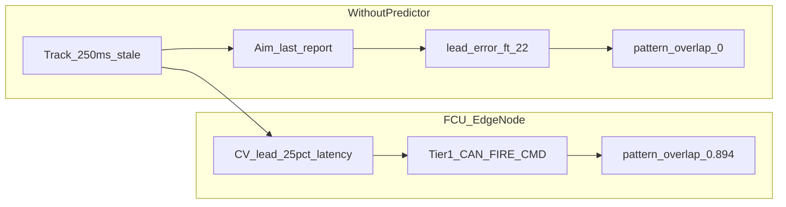

# FCU Edge Predictor — One-Pager

**Document ID:** MKFS-DOC-FCU-PRED-001  
**Version:** 0.1  
**Status:** Concept | Phase 9  
**Purpose:** Explain why local FCU prediction and CAN-isolated fire commit make terminal kinetic viable under stale tracks.  
**Key Decisions:** [D-013](DECISIONS.md) — track-to-primer SHALL NOT traverse TCP/IP  
**Open Questions:** Kalman/IMM predictor; multi-vehicle HIL (P9-007) — see [NETWORK_ARCHITECTURE.md](NETWORK_ARCHITECTURE.md) §11  
**Related Documents:** [NETWORK_ARCHITECTURE.md](NETWORK_ARCHITECTURE.md) | [ICD_SENSOR_INTEGRATION.md](ICD_SENSOR_INTEGRATION.md) | [latency_resilience_model.py](../scripts/latency_resilience_model.py) | [latency_resilience_output.json](../scripts/latency_resilience_output.json)

---

## The Problem

At **60 mph** and **250 ms** track delay, a constant-velocity target moves **22.0 ft** before aim updates. The terminal pattern at 350 ft has **`pattern_radius_ft` = 12.3** — so **`pattern_overlap_at_baseline` = 0.0**. Volume fire at last report **misses**. Sensor error not included.

Source: [`latency_resilience_output.json`](../scripts/latency_resilience_output.json) `baseline_reference`.

---

## Before / After

| | Without predictor | With FCU predictor |
|--|-------------------|---------------------|
| Effective delay | 250 ms | **`predictor_effective_delay_ms` = 62.5** |
| Lead error | **`lead_error_ft` = 22.0** | ~5.5 ft (25% of 250 ms) |
| Pattern overlap | **`pattern_overlap_at_baseline` = 0.0** | **`pattern_overlap_with_predictor` = 0.894** |
| Fire path | N/A — miss | CAN `FIRE_CMD` ≤ 5 ms |

---

## How the FCU Edge Node Solves It

1. **Co-mounted sensor** → CAN `0x300 TRACK` (local, not brigade net).
2. **Constant-velocity lead** on FCU: `predictor_effective_delay_ms` = measured latency × **`parameters.predictor_delay_fraction` (0.25)**.
3. Aim **predicted intercept volume**, not last report (`Δx ≈ v · τ`).
4. **`FIRE_CMD`** on Tier 1 CAN only — never gated by TCP/IP C4ISR.

Regenerate numbers: `python scripts/latency_resilience_model.py`

---

## Three-Tier Architecture

| Tier | Latency | Role | Link |
|------|---------|------|------|
| **1 — Commit** | ≤ 5 ms | `FIRE_CMD`, primer, tubes | Vehicle **CAN** |
| **2 — FCU edge** | ms | Fusion, triage, **predictor**, tube select | FCU compute + CAN |
| **3 — Intent** | s–min | ROE, inhibit zones, geofence | C4ISR / FCU panel *(lossy OK)* |

**D-013:** C4ISR delivers mission intent only. Track-to-primer **SHALL NOT traverse TCP/IP**.

---

## Why This Matters for Terminal Swarm Defense

Multidirectional swarms overload centralized fusion and degrade TCP/IP. MKFS is a **close-in terminal** layer — threats inside **~500 yd** outer envelope; **effective range 150–350 yd** via low-pressure distributed tube fire. Tracks are stale, links are lossy, and the vehicle cannot wait for brigade round-trip. Local prediction + CAN commit keeps **`pattern_overlap_with_predictor` = 0.894** at the critic baseline while Tier 3 intent degrades gracefully.

Operator **ARMED** required at every degradation level. No autonomous fire.

---

## Current Status

**Model-only.** CV lead is implemented in [`latency_resilience_model.py`](../scripts/latency_resilience_model.py) and documented in [NETWORK_ARCHITECTURE.md](NETWORK_ARCHITECTURE.md). Kalman/IMM in FCU hardware, gossip radio, and multi-vehicle HIL (P9-007) **remain unvalidated**.

---

*This is the part that makes last-ditch kinetic actually work when tracks are stale.*

---

## Revision History

| Version | Date | Change |
|---------|------|--------|
| 0.1 | 2026-05-24 | Initial one-pager — Phase 9 quant anchor |
