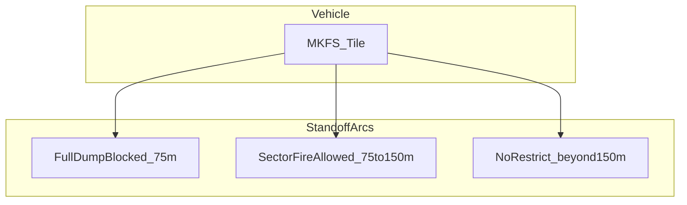

# MKFS Fratricide & Deconfliction

**Document ID:** MKFS-DOC-SAFE-001  
**Version:** 0.1 (Phase 5)  
**Mitigates:** R-004 in [RISK_REGISTER.md](RISK_REGISTER.md)  
**Related:** [DUAL_ARRAY_FIRE_PLANS.md](DUAL_ARRAY_FIRE_PLANS.md) | [FCU_STATE_MACHINE.md](../src/fire_control/FCU_STATE_MACHINE.md) | [CONOPS_VIGNETTES.md](CONOPS_VIGNETTES.md)

---

## 1. Problem Statement

MKFS fires **thousands of flechettes** into a terminal volume. Friendly troops, adjacent vehicles, aircraft, and existing APS/CIWS systems must be **protected from inadvertent engagement** and **collateral flechette hazard**.

---

## 2. FCU Interlocks

From [FCU_STATE_MACHINE.md](../src/fire_control/FCU_STATE_MACHINE.md):

| ID | Condition | Action |
|----|-----------|--------|
| SI-002 | Friendly zone inhibit (GPS + turret aspect) | Block tubes in inhibit arc |
| SI-003 | Module elevation < −5° or > +60° | Block fire |
| SI-001 | Vehicle speed > 5 kph | Block ARMED unless override |

**Additional MKFS interlocks (concept):**

| ID | Condition | Action |
|----|-----------|--------|
| SI-006 | Dismount zone active within 75 m | Limit to **SECTOR_** profiles only |
| SI-007 | Friendly aircraft ADIZ overlap | Full inhibit until clear |
| SI-008 | Trophy/APS active engagement | 500 ms hold — avoid dual intercept |

---

## 3. Dismounted Troop Standoff Arcs

| Troop distance | Permitted profile | Elevation trim |
|----------------|-------------------|----------------|
| < 75 m | **HOLD** — no fire | — |
| 75–150 m | **SECTOR_** masks only | +3° to +8° minimum |
| > 150 m | All profiles per ROE | FCU computed |

See Vignette 3 in [CONOPS_VIGNETTES.md](CONOPS_VIGNETTES.md).

---

## 4. Dual-Array Overlap

Per [DUAL_ARRAY_FIRE_PLANS.md](DUAL_ARRAY_FIRE_PLANS.md), forward and aft modules overlap at vehicle quarters. FCU must **deduplicate tube masks** in overlap zones when both modules engage the same azimuth — prevents double-cloud on friendly dismount side.

---

## 5. Coexistence with Other Systems

| System | Deconfliction |
|--------|---------------|
| **Trophy / APS** | MKFS fires **outside** APS engagement envelope (> 50 m) or on SI-008 hold |
| **CIWS / Phalanx** | MKFS is terminal backup — CIWS owns inner bubble; MKFS owns 200–500 yd band |
| **Friendly rotary-wing** | SI-007 + altitude filter — no fire above 200 ft AGL in friendly corridor |
| **Dismounted infantry** | SI-006 sector masks — never LAST_DITCH_FULL with troops near |

---

## 6. Training & ROE Checklist

Before arming MKFS:

- [ ] Dismount status confirmed on FCU
- [ ] Friendly air corridor checked
- [ ] APS/CIWS status acknowledged
- [ ] Inhibit arcs set for troop position
- [ ] Salvo profile selected *(default: SWARM_WIDE, not FULL)*
- [ ] Commander authorizes ARMED

**LAST_DITCH_FULL** requires **dual confirmation** (commander + gunner) when any friendly within 150 m.

---

## 7. Range / Test Safety

T5 test per [SWARM_TEST_CONCEPT.md](SWARM_TEST_CONCEPT.md): 200 m lateral standoff, 600 m downrange clear. Instrumented inhibit zones validate SI-002 before live swarm surrogates.

---

## 8. Revision History

| Version | Date | Change |
|---------|------|--------|
| 0.1 | 2026-05-22 | Initial fratricide and deconfliction concept |
