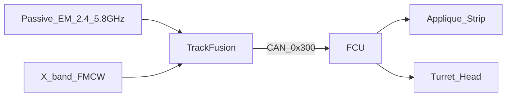
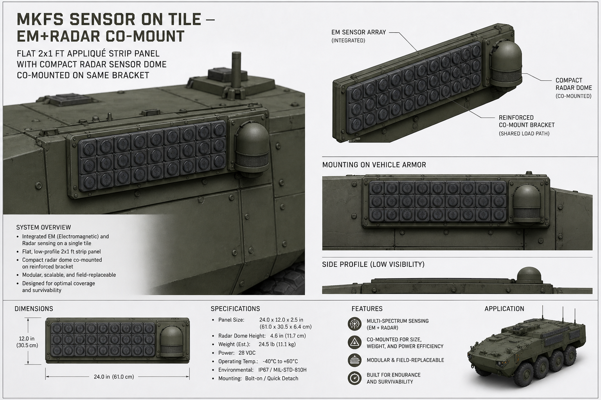

# MKFS Terminal Drone Sensor — Radar + EM

**Status:** Concept | Phase 9
**Purpose:** Co-mounted terminal EM/radar cueing envelope.
**Key Decisions:** See [DECISIONS.md](DECISIONS.md)
**Open Questions:** See [RISK_REGISTER.md](RISK_REGISTER.md)

**Document ID:** MKFS-ICD-RADAR-001  
**Version:** 0.2 (terminal band only)  
**Product:** `MKFS-SENS-EM-RADAR`  
**Related:** [ICD_SENSOR_INTEGRATION.md](ICD_SENSOR_INTEGRATION.md) | [MKFS_CORE_ENHANCEMENTS.md](MKFS_CORE_ENHANCEMENTS.md) | [FCU_STATE_MACHINE.md](../src/fire_control/FCU_STATE_MACHINE.md)

---

## 1. Purpose

Compact **radar + passive EM** kit mounted **on or beside MKFS tiles/turret** — detects Group 1–2 drones in the **terminal band (50–800 yd)** and cues FCU to fire **appliqué strips and pan-tilt turret only**.

This is **not** a long-range engagement system. It exists so MKFS sees the swarm **before** it is on the vehicle skin — still inside the puck cloud envelope.

---

## 2. What We Are / Are Not Doing

| Yes | No |
|-----|-----|
| Cue MKFS tile / turret salvos | 30 mm chain gun puck shells |
| Detect FPV datalink + air track | AMR / Gustaf / shoulder LR pods |
| Co-mount on MKFS mast | BLOS air defense |
| Hand track to FCU for LAST_DITCH_FULL | Replace vehicle organic AD |

---

## 3. Dual-Mode Sensor

| Mode | Detects | Range |
|------|---------|-------|
| **Active radar** | Physical drone (RCS ~0.01 m²) | **50–800 yd** |
| **Passive EM** | Control link bearing (2.4 / 5.8 GHz) | Cues radar search |

**EM type** = active RF radar + passive RF listen. Finds drones in clutter when EO/IR fails.

---

## 4. Specifications *(Concept)*

| Parameter | Value |
|-----------|-------|
| Mass | ≤ 15 kg *(integrated with tile mast)* |
| Power | 75 W avg / 120 W peak @ 28 VDC |
| Azimuth | 360° *(mast)* or 180° *(forward tile)* |
| Elevation | −5° to +45° |
| Tracks | 32 simultaneous |
| Update | 10 Hz |
| Interface | CAN 2.0B — extends [ICD_SENSOR_INTEGRATION.md](ICD_SENSOR_INTEGRATION.md) |

### Mount — on MKFS, not separate mast farm

| Package | Sensor mount |
|---------|----------------|
| 2×1 / 3×1 strip | Low-profile array on tile edge |
| Pan-tilt turret | Co-mount on yoke — **same head that fires** |
| MRAP kit | ADP-MAST-OPT tied to tile plate |

---

## 5. FCU Engagement *(Terminal Only)*

| Track range | FCU action |
|-------------|------------|
| 400–800 yd | Alert + stage **SWARM_WIDE** — operator arms |
| 250–500 yd | **Primary kill band** — sector or full tile salvo |
| < 250 yd | **LAST_DITCH_FULL** if authorized |
| Stale > 500 ms | Hold fire |

Radar **never** autonomously fires. Operator arms FCU; sensor provides track to existing presets in [FCU_STATE_MACHINE.md](../src/fire_control/FCU_STATE_MACHINE.md).

---

## 6. Co-Mount Concept Render

---

## 7. Honest Limits

- No sensor sees **every** drone — birds, ground clutter, autonomous pre-planned paths still hurt  
- Passive EM silent when link is off  
- Not a replacement for vehicle RWS — ** augments** MKFS cueing  

---

## 8. Revision History

| Version | Date | Change |
|---------|------|--------|
| 0.1 | 2026-05-22 | Initial draft *(included LR — rejected)* |
| 0.2 | 2026-05-22 | **Terminal band only**; MKFS tile/turret cueing |
| 0.3 | 2026-05-22 | Phase 8 — co-mount concept render |
