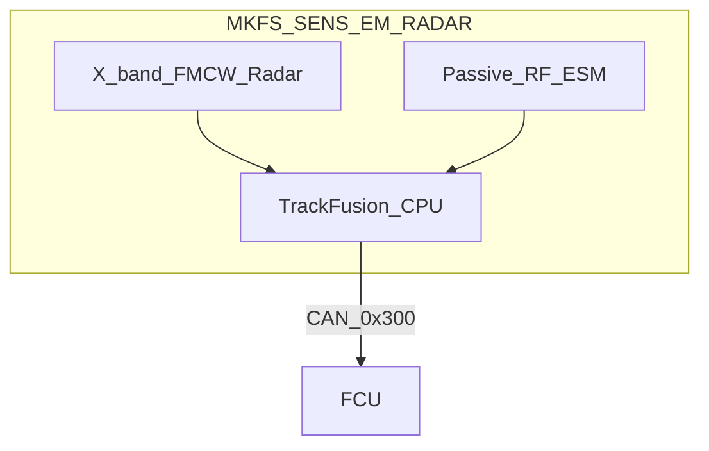

# MKFS Drone Detection Radar & EM Sensor

**Document ID:** MKFS-ICD-RADAR-001  
**Version:** 0.1 (Phase 6 concept)  
**Product:** `MKFS-SENS-EM-RADAR`  
**Related:** [ICD_SENSOR_INTEGRATION.md](ICD_SENSOR_INTEGRATION.md) | [LR_MUNITION_VARIANTS.md](LR_MUNITION_VARIANTS.md) | [FCU_STATE_MACHINE.md](../src/fire_control/FCU_STATE_MACHINE.md)

---

## 1. Purpose

Define a **dedicated drone-detection sensor** for MKFS — compact **radar + passive EM** — that picks up Group 1–2 UAS (quadcopter through small fixed-wing) and cues FCU for terminal strips **and** LR munition variants.

Baseline vehicle EO/IR is not enough at 800 yd in clutter. This kit **sees the drone**, not just the operator's eyeballs.

---

## 2. Sensor Concept — "EM Type" Dual Mode



| Mode | What it detects | How |
|------|-----------------|-----|
| **Active radar** | Physical drone — RCS down to ~0.01 m² | X-band FMCW pulse-Doppler |
| **Passive EM (ESM)** | Drone datalink — 2.4 / 5.8 GHz ISM, analog FPV | Direction-finding antenna |
| **Fusion** | Combined track — radar primary, EM confirms / cues search |

**"EM type"** = electromagnetic sensing: **active RF transmit/receive (radar)** plus **passive RF listen (ESM)**. Not laser. Not purely optical.

---

## 3. Active Radar — Specifications *(Concept)*

| Parameter | Value |
|-----------|-------|
| Designation | `MKFS-RAD-FMCW-X` |
| Band | X-band (~10 GHz) |
| Type | FMCW pulse-Doppler |
| Azimuth coverage | **360°** *(mast mount)* or **180°** *(forward-only cheek mount)* |
| Elevation | −5° to +55° |
| Range | **50–1,500 yd** (45–1,370 m) |
| Min RCS | **0.01 m²** @ 500 yd *(Group 1 quadcopter class)* |
| Track capacity | **32 simultaneous** |
| Update rate | 10 Hz |
| IFF | **None** — operator confirm required |

### What it will pick up

| Target | Detect @ 500 yd | Notes |
|--------|-------------------|-------|
| FPV quadcopter | Yes | Primary design case |
| Fixed-wing Group 2 | Yes | Higher RCS |
| Bird | Sometimes | Clutter rejection filter — velocity gate |
| Helicopter | Yes | FCU ROE block — friendly air inhibit |

---

## 4. Passive EM — Specifications *(Concept)*

| Parameter | Value |
|-----------|-------|
| Designation | `MKFS-ESM-ISM` |
| Bands | 2.4 GHz, 5.8 GHz *(extensible)* |
| Function | Detect + **DF bearing** to drone control link |
| Range | **800 m–2 km** *(depends on transmitter power)* |
| Use | Cue radar search sector; detect swarm before visual |

**EW-degraded environment:** Radar still works if drone is autonomous / pre-programmed. ESM helps when RF link is active.

---

## 5. Physical Package

| Parameter | Value |
|-----------|-------|
| Kit ID | `MKFS-SENS-EM-RADAR` |
| Mass | ≤ 22 kg *(radar + ESM + processor)* |
| Power | 90 W avg / 150 W peak @ 28 VDC |
| Mount options | Adapter mast (MRAP), turret yoke cheek, USV tower |
| Environmental | −32°C to +55°C; IP67 antenna enclosure |

### Form factor sketch

```
        ┌─────────┐
        │ planar  │  ← X-band array (~30 cm)
        │  array  │
        └────┬────┘
             │ mast or cheek bracket
        ┌────┴────┐
        │ ESM fins│  ← 2.4/5.8 GHz DF
        └─────────┘
```

---

## 6. FCU Interface

Extends [ICD_SENSOR_INTEGRATION.md](ICD_SENSOR_INTEGRATION.md) CAN map:

| Msg ID | Direction | Content |
|--------|-----------|---------|
| 0x300 | Sensor → FCU | Track report (az, el, range, velocity, RCS class) |
| 0x301 | Sensor → FCU | EM bearing + band |
| 0x302 | FCU → Sensor | Sector search cue |
| 0x303 | Sensor → FCU | Heartbeat / fault |

### Track fusion priority

1. **MKFS-SENS-EM-RADAR** fused track  
2. Vehicle organic radar *(if exportable)*  
3. RWS EO/IR manual  
4. Commander manual entry  

Stale track > 500 ms → FCU hold fire.

---

## 7. Engagement Logic

| Range | FCU recommendation |
|-------|-------------------|
| 800–1,500 yd | Cue **MKFS-LR** (30 mm / AMR / Gustaf) if fitted — [LR_MUNITION_VARIANTS.md](LR_MUNITION_VARIANTS.md) |
| 400–800 yd | Pre-stage terminal strip **SWARM_WIDE** |
| 200–500 yd | **LAST_DITCH_FULL** or sector salvo |
| < 200 yd | Terminal dump + APS deconfliction |

Radar does **not** autonomously fire — operator arms FCU; sensor provides track.

---

## 8. Platform Integration

| Platform | Mount | Notes |
|----------|-------|-------|
| Stryker | Forward adapter mast | Clears RWS dead zone |
| JLTV | Roof mast | Convoy escort |
| MRAP | ADP-MAST-OPT *(included in MRAP kit)* | Primary target platform |
| Pan-tilt turret | Co-mount on yoke | Radar + shooter same head |
| USV | Tower top | Maritime spinoff |
| FOB fixed | Perimeter tower | See [MARITIME_FIXED_SITE.md](MARITIME_FIXED_SITE.md) |

---

## 9. Comparison to Baseline Optional Kit

| | `MKFS-SENS-SWARM-OPT` (v0.1) | `MKFS-SENS-EM-RADAR` (this doc) |
|--|-------------------------------|----------------------------------|
| Radar | FMCW only | FMCW + **passive EM** |
| Range | 50–800 yd | **50–1,500 yd** |
| EM datalink detect | No | **Yes** |
| Mass | ≤ 15 kg | ≤ 22 kg |
| LR munition cue | No | **Yes** |

**Recommendation:** Supersede v0.1 swarm kit spec with this doc for Phase 6; keep D-005 "optional" decision.

---

## 10. Honest Limits

| Limit | Reality |
|-------|---------|
| "Any drone" | **No sensor sees everything** — low RCS, nap-of-earth, and weather still hurt |
| Birds / clutter | Requires AI classifier or operator confirm |
| Spectrum | Passive EM useless on fully autonomous pre-planned path |
| Cost | Compact C-UAS radars run **$50K–$200K+** per unit ROM |
| ITAR | Radar export may be controlled — see [ITAR_EXPORT_FRAMING.md](ITAR_EXPORT_FRAMING.md) |

---

## 11. Revision History

| Version | Date | Change |
|---------|------|--------|
| 0.1 | 2026-05-22 | Initial EM/radar drone detection sensor concept |
