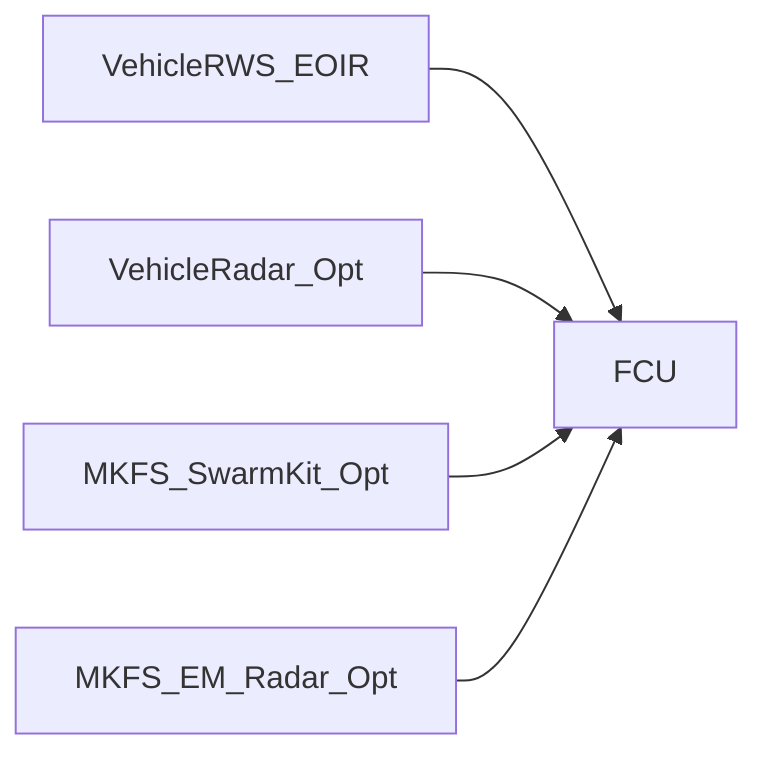

# MKFS Sensor Integration Requirements

**Document ID:** MKFS-ICD-SENS-001  
**Version:** 0.2 (terminal sensor integration)  
**Decision D-005:** **Vehicle sensors baseline; optional swarm sensor kit**  
**Related:** [ICD_DRONE_RADAR.md](ICD_DRONE_RADAR.md) | [MKFS_CORE_ENHANCEMENTS.md](MKFS_CORE_ENHANCEMENTS.md) | [SYSTEM_ARCHITECTURE.md](architecture/SYSTEM_ARCHITECTURE.md) | [ICD_POWER_C4ISR.md](ICD_POWER_C4ISR.md)

---

## 1. Sensor Architecture

---

## 2. Baseline — Vehicle Sensors

| Source | Data | Interface | Latency Target |
|--------|------|-----------|----------------|
| RWS EO/IR | Bearing, elevation, video track | Ethernet or RS-170 | < 500 ms |
| Vehicle GPS/INS | Platform position, heading | CAN or 1553 | < 100 ms |
| Commander manual | Azimuth/elevation entry | FCU panel | Immediate |

**Baseline configuration:** No dedicated MKFS sensor required. FCU accepts manual cue or RWS track if vehicle provides export.

---

## 3. Optional — MKFS Swarm Sensor Kit (`MKFS-SENS-SWARM-OPT`)

> **v0.2:** Enhanced by [`MKFS-SENS-EM-RADAR`](ICD_DRONE_RADAR.md) — radar + passive EM, **50–800 yd terminal band**, cues MKFS tiles/turret only.

| Parameter | Specification |
|-----------|---------------|
| Type | Compact X-band FMCW radar *(conceptual)* |
| Coverage | 360°, 30° elevation, 50–800 yd |
| Track capacity | 32 simultaneous |
| Mass | ≤ 15 kg |
| Power | 75 W avg, 120 W peak |
| Mount | Adapter mast (MRAP kit included; others optional) |
| Interface | CAN 0x300 TRACK messages |

**Decision D-005:** Optional kit — not required for baseline vehicle integration. Recommended for convoy/MRAP missions without organic air defense cueing. **See [ICD_DRONE_RADAR.md](ICD_DRONE_RADAR.md) for Phase 6 EM/radar spec.**

---

## 3b. Optional — MKFS EM/Radar Kit (`MKFS-SENS-EM-RADAR`)

Full specification: [ICD_DRONE_RADAR.md](ICD_DRONE_RADAR.md)

| Parameter | Specification |
|-----------|---------------|
| Type | X-band FMCW radar + passive ISM ESM |
| Coverage | 360°, **50–800 yd** *(terminal band)* |
| Detect | Group 1–2 UAS; datalink EM bearing |
| Cues | **MKFS appliqué strips + turret only** |

---

## 4. Track Fusion (FCU Software)

| Priority | Source | Use |
|----------|--------|-----|
| 1 | Swarm sensor (if fitted) | Primary auto-track |
| 2 | Vehicle radar track | Secondary auto-track |
| 3 | RWS manual track | Tertiary |
| 4 | Manual FCU entry | Fallback |

Stale track (> 500 ms) → hold fire, alert operator.

---

## 5. Integration by Platform

| Platform | Baseline Cue | Optional Kit Mount |
|----------|--------------|-------------------|
| Stryker | RWS (CROWS) | Adapter mast on forward plate |
| Bradley | CIV / RWS | Turret bustle mast |
| M113 | Manual / external | Not recommended (power/space) |
| LAV-25 | RWS | Low-profile mast |
| MRAP | CROWS + optional kit | ADP-MAST-OPT included in MRAP kit |

---

## 6. Revision History

| Version | Date | Change |
|---------|------|--------|
| 0.1 | 2026-05-22 | Baseline vs optional kit defined; D-005 closed |
| 0.2 | 2026-05-22 | Terminal EM/radar kit; MKFS tile/turret cueing only |
