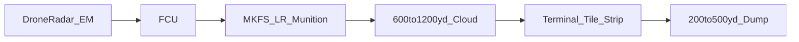

# MKFS-LR — Long-Range Munition Variants

**Document ID:** MKFS-DOC-LR-001  
**Version:** 0.1 (Phase 6 concept)  
**Status:** Idea monkey — not baseline MKFS  
**Related:** [CARRIER_PROJECTILE_ICD.md](CARRIER_PROJECTILE_ICD.md) | [PUCK_RELEASE.md](PUCK_RELEASE.md) | [DESIGN_PHILOSOPHY.md](DESIGN_PHILOSOPHY.md) | [ICD_DRONE_RADAR.md](ICD_DRONE_RADAR.md)

---

## 1. What This Is

Baseline MKFS is **terminal** (200–500 yd) — tile strips and turret dumps when the swarm is already on you.

**MKFS-LR** is a **spinoff packaging line**: the **same hollow-point puck DNA** merged into **munitions and launchers the force already carries** — so you can **reach farther** and **cue earlier**, then hand off to terminal strips when targets leak inside 500 yd.

Same rules: **kinetic only, no HE in the effector, no guidance in the round.**



---

## 2. Design Fusion — One Puck, Many Launchers

| Host | Designation | Reach band | Role |
|------|-------------|------------|------|
| **30 mm chain gun** | `MKFS-CART-30-SHELL` | 600–1,000 yd | Area denial burst from existing Bushmaster |
| **Anti-materiel rifle** | `MKFS-CART-50-AMR` | 800–1,500 yd | Precision cue + cloud from sniper team |
| **Carl Gustaf M4** | `MKFS-CART-84-GUSTAF` | 400–900 yd | Squad-level extended reach |
| **Shoulder launcher pod** | `MKFS-POD-DL` *(disposable)* | 500–1,200 yd | Javelin-**form** unguided kinetic pod — **not** a Javelin seeker mod |

**Not in scope:** Modifying Javelin guidance electronics. Javelin stays ATGM. The disposable pod is a **parallel launcher** — same shoulder workflow, different round.

---

## 3. Variant A — 30 mm Shell (`MKFS-CART-30-SHELL`)

### Concept

Embed the **31 mm puck** (or puck cluster) inside a standard **30×173 mm** (or 30×113 mm) case compatible with Mk 44 / Bushmaster chain guns.

| Mode | Description |
|------|-------------|
| **Single puck** | Sabot-mounted puck; fires like API — releases cloud at extended `R_open` |
| **Tri-puck canister** | Three pucks stacked in case — sequential setback release in flight |

### Parameters *(concept ROM)*

| Parameter | Tile puck | 30 mm shell |
|-----------|-----------|-------------|
| Muzzle velocity | 900 m/s | 1,050–1,200 m/s *(long barrel)* |
| `R_open` | ~200 ft | **400–600 ft** *(tuned skirt latch)* |
| Effective band | 250–500 yd | **600–1,000 yd** |
| Flechettes per shot | ~100 | ~100–300 |
| Logistics | MKFS pod | **Existing 30 mm link** |

### Employment

- Vehicle with chain gun + MKFS strips: gun fires **LR shells** at cued swarm at 800 yd; survivors close; **tile strip** finishes at 350 yd  
- FCU receives radar track → recommends **30 mm cloud burst** azimuth before terminal dump  

---

## 4. Variant B — Anti-Materiel Rifle (`MKFS-CART-50-AMR`)

### Concept

**Saboted sub-caliber puck** in **.50 BMG (12.7×99 mm)** for Barrett M107, MRAD, or similar.

```
  .50 BMG case
  ┌──────────────────┐
  │  sabot  │ 31mm   │  ← puck nested in front
  │         │ puck   │
  └──────────────────┘
```

| Parameter | Value |
|-----------|-------|
| Muzzle velocity | 900 m/s *(puck release post-sabot strip)* |
| `R_open` | 500–700 ft |
| Effective band | 800–1,500 yd |
| Crew | 2 — gunner + FCU spotter with tablet |

### Employment

Sniper/security element engages **high-value drone or swarm lead** at extended range. Not volume fire — **one cloud per trigger**. Complements vehicle terminal layer; does not replace it.

---

## 5. Variant C — Carl Gustaf (`MKFS-CART-84-GUSTAF`)

### Concept

**84 mm recoilless** canister round — MKFS puck pack in a **short-range extended** profile between rifle and vehicle.

| Parameter | Value |
|-----------|-------|
| Case | 84 mm HE-canister form factor — **kinetic fill only** |
| Payload | 6–12 pucks or one **mega-puck** dispersing sub-clusters |
| Range | 400–900 yd |
| `R_open` | 300–500 ft |

### Employment

Squad in overwatch fires Gustaf cloud into approach corridor before enemy FPV reaches friendly vehicles. Reload: standard Gustaf rate.

---

## 6. Variant D — Disposable Shoulder Pod (`MKFS-POD-DL`)

### Concept

**Javelin-sized** launch tube — same carry, mount, and crew muscle memory — but fires an **unguided puck salvo** (5–9 tubes in disposable pod) at radar cue.

| | Javelin ATGM | MKFS-POD-DL |
|--|--------------|-------------|
| Guidance | IR seeker | **None** |
| Target | Armor | **Drone swarm volume** |
| Cost | $200K+ | **$2K–5K ROM** |
| Reload | Single shot | Single shot disposable |

**Why "Javelin-adjacent":** Form factor and employment — **not** merged into Javelin electronics.

---

## 7. Layered Kill Chain

| Layer | System | Range |
|-------|--------|-------|
| 1 — Detect | [MKFS-SENS-EM-RADAR](ICD_DRONE_RADAR.md) | 50–1,500 yd |
| 2 — Extended kinetic | MKFS-LR munitions | 600–1,500 yd |
| 3 — Terminal | Appliqué strips / turret | 200–500 yd |
| 4 — Inner | CIWS / APS *(if present)* | < 200 yd |

LR variants **buy time** — they do not replace terminal MKFS.

---

## 8. Honest Limits

| Limit | Notes |
|-------|-------|
| No guidance | LR clouds still saturate volume — miss fast maneuver at extreme range |
| Single-shot AMR/Gustaf | Not swarm-rate — pick engagement |
| 30 mm feed rate | Chain gun sustained fire heats barrel; not infinite |
| Logistics | Each variant needs its own cartridge qual — years of work |
| Javelin confusion | We are **not** modifying Javelin — parallel pod only |

---

## 9. Next Concept Work

1. Ballistics model extension — `R_open` tuning for 1,050 m/s 30 mm shell  
2. FCU profile: `LR_30MM_BURST`, `LR_AMR_SINGLE`, `HANDOFF_TERMINAL`  
3. Adapter ICD: chain gun FCU bus tap  
4. Range test concept — T2-LR series  

---

## 10. Revision History

| Version | Date | Change |
|---------|------|--------|
| 0.1 | 2026-05-22 | Initial LR munition variant concept |
