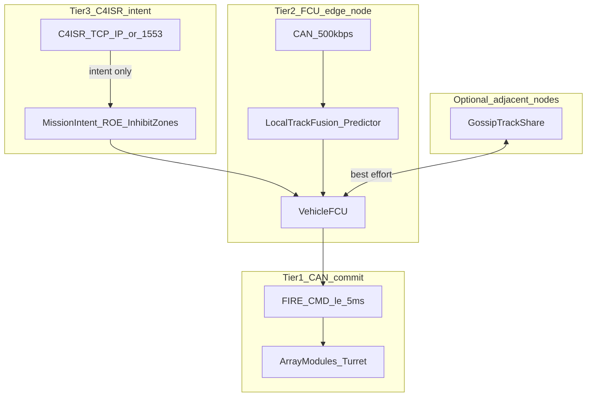

# MKFS Network & C2 Architecture

**Status:** Concept | Phase 9
**Purpose:** Tier 1/2/3 C2, latency model, degradation ladder, packet loss.
**Key Decisions:** See [DECISIONS.md](DECISIONS.md)
**Open Questions:** See [RISK_REGISTER.md](RISK_REGISTER.md)

**Document ID:** MKFS-DOC-NET-001  
**Version:** 0.2.2 (Phase 9 hardening)  
**Related Documents:** [ICD_POWER_C4ISR.md](ICD_POWER_C4ISR.md) | [ICD_SENSOR_INTEGRATION.md](ICD_SENSOR_INTEGRATION.md) | [FRATRICIDE_DECONFLICTION.md](FRATRICIDE_DECONFLICTION.md) | [SWARM_TEST_CONCEPT.md](SWARM_TEST_CONCEPT.md) | [FCU_EDGE_PREDICTOR_ONEPAGER.md](FCU_EDGE_PREDICTOR_ONEPAGER.md) | [latency_resilience_model.py](../scripts/latency_resilience_model.py) | [DECISIONS.md](DECISIONS.md) D-013

---

## 1. Problem Statement

Distributed terminal defense fails when **multidirectional swarms overload centralized fusion** or **TCP/IP links** add packet loss, retransmit storms, head-of-line blocking, and variable latency. At **60 mph** and **250 ms** track delay, uncompensated motion is **`baseline_reference.lead_error_ft` = 22.0 ft** — greater than **`pattern_radius_ft` = 12.3 ft**, so **`pattern_overlap_at_baseline` = 0.0** ([`latency_resilience_output.json`](../scripts/latency_resilience_output.json)). MKFS is a **close-in terminal / last-ditch** layer — relevant when threats have penetrated inside **~500 yd** (outer threat envelope); **effective engagement is 150–350 yd** (useful pattern density to **~400–450 yd** optimal). M1 uses **low-pressure distributed/sequenced** tube fire, not long-range high-pressure shots. Not BLOS cueing or base-wide fusion. This document defines **Tier 1 CAN-only** fire commit independent of low-latency C4ISR.

### TCP/IP limitations

| Failure mode | Effect on terminal engagement |
|--------------|------------------------------|
| Packet loss | Missed or stale tracks; FCU fires on old aim point |
| Retransmit storms | Latency spikes; head-of-line blocking |
| Central fusion saturation | Track updates drop when count exceeds node capacity |
| Single point of failure | One C2 node loss degrades entire sector |

Baseline ICD ([`ICD_POWER_C4ISR.md`](ICD_POWER_C4ISR.md)) documents optional TCP/IP C4ISR and **500 ms stale-track hold-fire**. Phase 9 adds architecture and modeling for overload, loss, and prediction — not fielded hardware.

---

## 2. Design Principle — Tier 1 Commit on CAN Only

**[D-013](DECISIONS.md):** Track-to-primer **SHALL NOT traverse TCP/IP**. C4ISR delivers **mission intent only**; it does not gate `FIRE_CMD`.



**Tier 1 — CAN commit path (existing ICD):**

1. Co-mounted sensor → CAN `0x300 TRACK`
2. FCU edge node: local fusion + **local predictor** → aim point
3. FCU → CAN `0x100 FIRE_CMD` → primer (≤ 5 ms)

**Tier 2 — FCU edge node:** fusion, triage, prediction, tube selection (milliseconds).

**Tier 3 — C4ISR intent:** sector masks, ROE, authorized profiles, geofence (seconds–minutes; lossy OK).

---

## 3. Hierarchical Intent-Based C2

| Layer | Latency | Content | Link |
|-------|---------|---------|------|
| Tier 3 — mission | Minutes | Area priorities, weapons-free rules | C4ISR |
| Tier 3 — tactical intent | Seconds | Terminal arc, authorized profiles | C4ISR or FCU panel |
| Tier 2 — execution | Milliseconds | Tubes, elevation, **predicted intercept volume** | FCU (CAN) |

Commander or C4ISR sets intent and inhibit zones. FCU executes each track update **without brigade round-trip**. Operator **ARMED** remains required ([`FRATRICIDE_DECONFLICTION.md`](FRATRICIDE_DECONFLICTION.md)).

---

## 4. Edge-Heavy Track Management (Tier 2)

Per [`ICD_SENSOR_INTEGRATION.md`](ICD_SENSOR_INTEGRATION.md) §4:

### 4.1 Fusion priority

| Priority | Source | Use |
|----------|--------|-----|
| 1 | Co-mounted EM/radar (CAN) | Primary auto-track |
| 2 | Vehicle radar | Secondary |
| 3 | RWS manual track | Tertiary |
| 4 | Manual FCU entry | Fallback |

Prefer **CAN-local** sources over TCP/IP when both exist.

### 4.2 Track triage (overload)

When tracks exceed sensor capacity (32 per [`ICD_DRONE_RADAR.md`](ICD_DRONE_RADAR.md)):

1. Closure rate toward defended asset
2. Range (**150–350 yd** effective engagement band weighted higher; threat may be tracked out to **~500 yd** envelope)
3. EM confidence

Engage top-N; coast lower-priority tracks. FCU logs overload; does not fault.

### 4.3 Local predictor

FCU edge node runs constant-velocity lead: `predictor_effective_delay_ms` = measured latency × `parameters.predictor_delay_fraction` (0.25). Aim point is predicted intercept, not last report.

```
Δx ≈ v · τ
```

---

## 5. Latency Mitigation — Quantitative Grounding

Source: [`latency_resilience_output.json`](../scripts/latency_resilience_output.json) `baseline_reference`:

| Field | Value |
|-------|-------|
| `lead_error_ft` | **22.0** |
| `pattern_diameter_ft` / `pattern_radius_ft` | **24.5** / **12.3** |
| `pattern_overlap_at_baseline` | **0.0** |
| `predictor_effective_delay_ms` | **62.5** |
| `pattern_overlap_with_predictor` | **0.894** |

At baseline, `pattern_overlap_at_baseline` = 0.0 because `lead_error_ft` (22.0) > `pattern_radius_ft` (12.3). Local predictor yields `pattern_overlap_with_predictor` = 0.894 at `predictor_effective_delay_ms` = 62.5.

`delay_sweep[].pattern_overlap` values **exclude** the local predictor (raw v·τ miss only).

Regenerate: `python scripts/latency_resilience_model.py`

### Delay sweep (selected; no predictor)

| Speed (mph) | Delay (ms) | `lead_error_ft` | `pattern_overlap` |
|-------------|------------|-----------------|---------------------|
| 60 | 100 | 8.8 | 0.696 |
| 60 | 250 | 22.0 | 0.00 |
| 60 | 500 | 44.0 | 0.00 |

---

## 6. Resilient Communication Patterns

### 6.1 Tier 1 — vehicle CAN (D-003)

500 kbps; FIRE_CMD, TRACK, ARM_CMD. Deterministic; not IP.

### 6.2 Optional adjacent-node gossip

Compressed track state (id, az, el, range, range_rate, timestamp, confidence). No central master. Merge under conservative fratricide rules (§7). ICD stub: P9-006.

### 6.3 CAN priority classes

| Class | Preempt | Examples |
|-------|---------|----------|
| P0 — kinetic | Yes | FIRE_CMD, ARM_CMD |
| P1 — track | Yes over P2 | TRACK, AIM_CMD |
| P2 — status | No | MOD_STATUS, SALVO_RPT |
| P3 — telemetry | No | ENGAGE_RPT |

### 6.4 Degradation ladder

| Level | Trigger | FCU edge node action |
|-------|---------|----------------------|
| **0** | Local sensor + C4ISR up | Full profiles per ROE |
| **1** | TCP/IP down | CAN tracks + last-known intent (30 s TTL) |
| **2** | Tracks > capacity | Triage top-N; local CV predictor (model: 62.5 ms eff. @ 250 ms baseline) |
| **3** | No auto-track | Sector scan; operator ARMED required |
| **4** | All auto tracks lost | Manual az/el only |

Operator ARMED required at every level.

---

## 7. Fratricide Under Partial Connectivity

See [`FRATRICIDE_DECONFLICTION.md`](FRATRICIDE_DECONFLICTION.md) §7.

| Source | Latency | Degraded behavior |
|--------|---------|-------------------|
| Vehicle GPS/INS | < 100 ms | Local truth for SI-002 |
| C4ISR friendly position | Seconds | Last-known TTL; expand inhibit if stale |
| Gossip friendly hull ID | Best effort | Conservative union |

**Rules:** Friendly position unknown → **SECTOR_** only (no LAST_DITCH_FULL). Conflicting inhibit → hold fire (SI-011). C4ISR lost → SI-009 (30 s TTL, then SECTOR-only).

---

## 8. Operational Context

Jam-resistant, long-link swarms break central fusion, TCP/IP-dependent fire paths, and RWS/Ethernet under EW. MKFS keeps Tier 1 on CAN: co-mounted sensor tracks, local CV predictor (`pattern_overlap_with_predictor` = 0.894 at baseline), manual cue at Level 4.

---

## 9. Separation of Concerns

| Function | Max latency | Link | Central required? |
|----------|-------------|------|-------------------|
| Primer fire command | ≤ 5 ms | CAN (Tier 1) | No |
| Track update → aim | ≤ 100 ms | CAN / vehicle LAN (Tier 2) | No |
| Track prediction | 62.5 ms effective @ 250 ms baseline (`predictor_effective_delay_ms`) | FCU compute (Tier 2) | No |
| ROE / ARMED | Seconds | FCU panel | No |
| Mission intent / geofence | Seconds–minutes | C4ISR (Tier 3) | Optional |
| Fleet picture | Seconds | TCP/IP / gossip | Optional |

---

## 10. Packet Loss — Cue Delivery

`packet_loss_sweep`: each row is `pattern_overlap_*` × `cue_delivery_prob` at baseline (60 mph, 250 ms).

| Packet loss | `cue_delivery_prob` | `pattern_overlap_at_baseline` | `pattern_overlap_with_predictor` |
|-------------|---------------------|-------------------------------|----------------------------------|
| 0% | 1.00 | 0.00 | 0.894 |
| 10% | 0.90 | 0.00 | 0.805 |
| 20% | 0.80 | 0.00 | 0.715 |
| 30% | 0.70 | 0.00 | 0.626 |

Tier 1 commit stays on CAN; retries add latency.

---

## 11. Gap Assessment

### Established

Documented and model-backed in-repo: Tier 1/2/3 split; D-013 CAN-only fire commit; [`latency_resilience_output.json`](../scripts/latency_resilience_output.json) baseline (`lead_error_ft` 22.0, `pattern_overlap_at_baseline` 0.0, `pattern_overlap_with_predictor` 0.894); Degradation Levels 0–4; network-stress tests T5-N01–N04; fratricide rules SI-009–011 under partial connectivity.

### Remains unvalidated

No field hardware or multi-vehicle sim for gossip radio, gossip authentication, or multi-node track correlation. FCU runs CV lead in the model only — Kalman/IMM not implemented. P9-007 HIL not built. Operator ARMED is mandatory at every degradation level; base-wide fusion is out of MKFS scope.

---

## 12. Next Steps

[`tasks/PHASE9.md`](../tasks/PHASE9.md)

---

## 13. Revision History

| Version | Date | Change |
|---------|------|--------|
| 0.1 | 2026-05-22 | Phase 9 — network/C2 resilience architecture |
| 0.2 | 2026-05-22 | Hardening — quant anchor, Tier 1/2/3 terminology, JSON field traceability |
| 0.2.1 | 2026-05-24 | Ruthless pass — pattern_overlap naming, note/JSON alignment, delay_sweep scope |
| 0.2.2 | 2026-05-24 | Final polish — §11 gap assessment, quant/predictor/degradation language |
