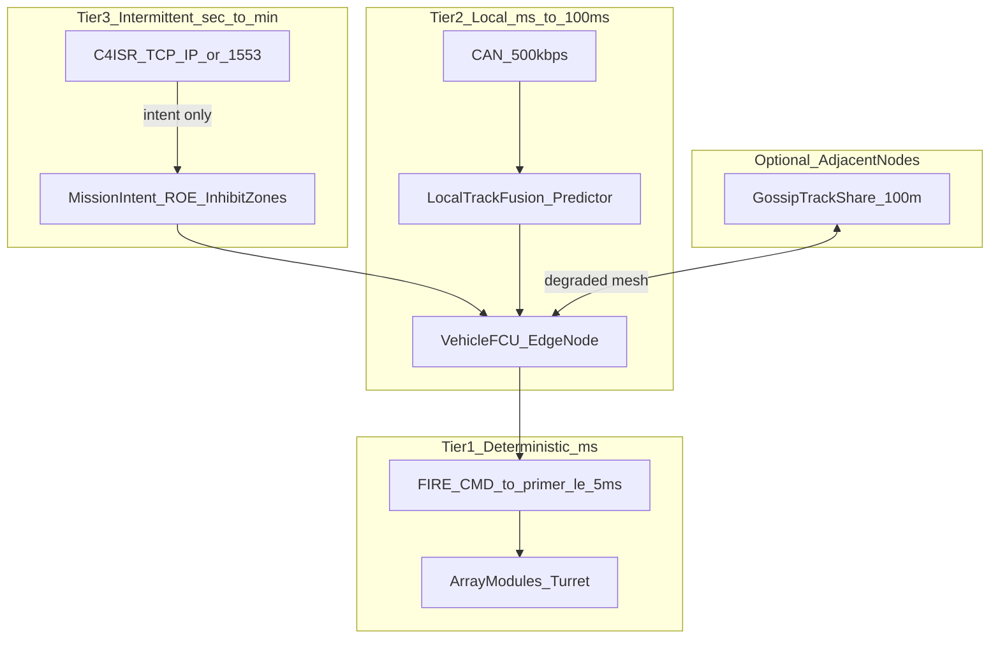

# MKFS Network & C2 Architecture

**Document ID:** MKFS-DOC-NET-001  
**Version:** 0.1 (Phase 9)  
**Related:** [ICD_POWER_C4ISR.md](ICD_POWER_C4ISR.md) | [ICD_SENSOR_INTEGRATION.md](ICD_SENSOR_INTEGRATION.md) | [FRATRICIDE_DECONFLICTION.md](FRATRICIDE_DECONFLICTION.md) | [SWARM_TEST_CONCEPT.md](SWARM_TEST_CONCEPT.md) | [latency_resilience_model.py](../scripts/latency_resilience_model.py)

---

## 1. Problem Statement

External critique of distributed terminal defense systems highlights a structural weakness: **multidirectional swarms overload centralized sensor fusion and C2 nodes**, while **TCP/IP links inject packet loss, retransmit storms, head-of-line blocking, and variable latency**. At **60 mph**, **250 ms** of stale track data implies **~22 ft** (~6.7 m) of uncompensated target motion — enough to miss a small UAS even before accounting for sensor error.

The March 2026 Barksdale AFB incident (multi-wave, jam-resistant drones with long-range links operating over sensitive areas for nearly a week) is cited as evidence that **network and comms resilience must be solved before terminal effectors matter**. This document does not claim MKFS solves BLOS air defense or replaces base-wide fusion. It defines how MKFS **reduces dependence on perfect low-latency central links** for the **terminal kinetic commit path**.

### TCP/IP limitations (explicit)

| Failure mode | Effect on terminal engagement |
|--------------|------------------------------|
| Packet loss | Missed or stale tracks; FCU fires on old aim point |
| Retransmit storms | Latency spikes under load; head-of-line blocking |
| Central fusion CPU/IO saturation | Track updates drop when track count exceeds node capacity |
| Single point of failure | One C2 node loss degrades entire sector |

MKFS baseline today ([`ICD_POWER_C4ISR.md`](ICD_POWER_C4ISR.md)) documents optional TCP/IP C4ISR and **500 ms stale-track hold-fire** but does not model overload, loss, or prediction. Phase 9 closes that gap in architecture and modeling — not in fielded hardware.

---

## 2. Design Principle — Kinetic Commit Never Waits on TCP/IP

**Decision D-013:** The path from track to primer **SHALL NOT traverse TCP/IP**. C4ISR may deliver **mission intent**; it must not gate individual fire commands.



**Tier-1 path (existing ICD):**

1. Co-mounted sensor → CAN `0x300 TRACK` ([`ICD_POWER_C4ISR.md`](ICD_POWER_C4ISR.md))
2. FCU local fusion + predictor → aim point
3. FCU → CAN `0x100 FIRE_CMD` → primer (≤ 5 ms)

C4ISR delivers **sector masks, ROE state, authorized salvo profiles, geofence updates** — not per-frame track ownership.

---

## 3. Hierarchical Intent-Based C2

| Layer | Latency | Content | Link |
|-------|---------|---------|------|
| **Strategic / mission** | Minutes | Area defense priorities, weapons-free rules | C4ISR (lossy OK) |
| **Tactical intent** | Seconds | "Defend terminal arc 090–140°; LAST_DITCH_FULL authorized if ≥ 4 tracks in band" | C4ISR or FCU panel |
| **Engagement execution** | Milliseconds | Tube selection, elevation, salvo profile, **predicted intercept volume** | FCU local (CAN) |

**High level (slow):** Commander or C4ISR sets intent and inhibit zones.  
**Local (fast):** FCU executes without round-trip to brigade for each track update.

Operator **ARMED** state remains required per [`FRATRICIDE_DECONFLICTION.md`](FRATRICIDE_DECONFLICTION.md). No autonomous fire without explicit future policy change.

---

## 4. Edge-Heavy Track Management

Extend [`ICD_SENSOR_INTEGRATION.md`](ICD_SENSOR_INTEGRATION.md) §4 fusion priority with:

### 4.1 Local fusion priority (unchanged baseline)

| Priority | Source | Use |
|----------|--------|-----|
| 1 | Co-mounted EM/radar (CAN) | Primary auto-track |
| 2 | Vehicle radar track | Secondary |
| 3 | RWS manual track | Tertiary |
| 4 | Manual FCU entry | Fallback |

**Prefer CAN-local sources over TCP/IP** when both are available.

### 4.2 Track triage (overload)

When track count exceeds sensor capacity (32 simultaneous per [`ICD_DRONE_RADAR.md`](ICD_DRONE_RADAR.md)):

1. Rank by **closure rate** (range rate toward defended asset)
2. Rank by **range** (inside terminal band 250–500 yd weighted higher)
3. Rank by **EM confidence** (datalink bearing corroboration)
4. Engage top-N; drop or coast lower-priority tracks with decaying confidence

FCU must not fault or block — triage and log overload event.

### 4.3 Predictor (engage where target will be)

Constant-velocity model on FCU:

```
Δx ≈ v · τ
```

With acceleration uncertainty:

```
σ_pos ≈ sqrt((v·τ)² + (0.5·a_max·τ²)² + (σ_v·τ)²)
```

Aim **predicted intercept volume**, not last report timestamp. Kalman-style filtering is the implementation target; CV model is the minimum viable spec.

---

## 5. Latency Mitigation — Quantitative Grounding

Run [`scripts/latency_resilience_model.py`](../scripts/latency_resilience_model.py) for full tables. Baseline reference:

| Parameter | Value |
|-----------|-------|
| Target speed | 60 mph (26.8 m/s) |
| Track delay | 250 ms |
| **Lead error** | **6.7 m / 22.0 ft** |
| MKFS pattern @ 350 ft | ~24.5 ft diameter |
| **Pattern overlap (no predictor)** | **0%** — target outside ~12.3 ft radius at 22 ft miss |
| **Pattern overlap (local predictor, ~75% delay cut)** | **~70%** — effective delay ~62 ms |

**Interpretation:** At the critic baseline (250 ms, 60 mph), **uncompensated aim puts the target outside the pattern** — volume fire does not forgive stale tracks without local prediction. Local predictor (concept: effective delay reduced ~75%) is **required**, not optional, for this scenario. At 500 ms / 60 mph (~44 ft error), overlap remains zero even with prediction unless salvo timing or lead computation improves.

### Delay sweep (selected rows)

| Speed (mph) | Delay (ms) | Lead error (ft) | Pattern overlap |
|-------------|------------|-----------------|-----------------|
| 60 | 100 | 8.8 | 0.78 |
| 60 | 250 | 22.0 | 0.00 (predictor ~0.70) |
| 60 | 500 | 44.0 | 0.00 |
| 90 | 250 | 33.0 | 0.12 |

Local predictor (concept: effective delay reduced ~75%) restores overlap at 250 ms from **0.00 → ~0.70** — predictor is mandatory for this scenario, not a nice-to-have.

---

## 6. Resilient Communication Patterns

### 6.1 Primary — vehicle CAN (D-003)

MKFS module bus at **500 kbps**. FIRE_CMD, TRACK, ARM_CMD on defined IDs. Deterministic; not IP.

### 6.2 Optional — adjacent-node gossip

Short-range convoy net (UHF burst, wired tether, or future mesh) sharing **compressed track state**:

| Field | Size (concept) |
|-------|----------------|
| track_id | 2 B |
| az, el, range | 6 B |
| range_rate | 2 B |
| timestamp | 4 B |
| confidence | 1 B |

No central master required. Nodes merge with **conservative fratricide rules** (see §7). Full ICD stub: future [`ICD_NODE_GOSSIP.md`](ICD_NODE_GOSSIP.md) (P9-006).

### 6.3 Priority cueing on CAN

| Class | Preempt | Examples |
|-------|---------|----------|
| P0 — kinetic | Yes | FIRE_CMD, ARM_CMD |
| P1 — track | Yes over P2 | TRACK, AIM_CMD |
| P2 — status | No | MOD_STATUS, SALVO_RPT |
| P3 — telemetry | No | ENGAGE_RPT to C4ISR |

### 6.4 Degradation ladder

| Level | Condition | FCU behavior |
|-------|-----------|--------------|
| **0 — Normal** | Local sensor + C4ISR intent | Full profiles per ROE |
| **1 — C4ISR loss** | TCP/IP down | Local sensor + **last-known intent TTL** (30 s default) |
| **2 — Sensor overload** | Tracks > capacity | Triage top-N; predictor on |
| **3 — Local sensor loss** | No auto-track | Pre-planned sector scan behaviors; **operator ARMED still required** |
| **4 — Manual only** | All auto tracks lost | FCU panel az/el entry |

Fire never autonomously initiates at any level under current policy.

---

## 7. Fratricide & Coordination Under Partial Connectivity

Cross-reference [`FRATRICIDE_DECONFLICTION.md`](FRATRICIDE_DECONFLICTION.md) §9.

| Source | Latency target | Degraded behavior |
|--------|----------------|-------------------|
| Vehicle GPS/INS | < 100 ms | **Local truth** for SI-002 inhibit arcs |
| C4ISR friendly position | Seconds (lossy) | Last-known TTL → expand inhibit if stale |
| Gossip friendly hull ID | Best effort | **Conservative union** — if uncertain, widen inhibit |

**Conflict rules:**

- Friendly position **unknown** → **SECTOR_** profiles only; no LAST_DITCH_FULL
- Conflicting inhibit from two nodes → **hold fire** (SI-011) until resolved
- C4ISR link lost → SI-009: use last-known inhibit 30 s, then SECTOR-only

---

## 8. Operational Context — Barksdale-Class Stress

Multi-wave, jam-resistant drones with **long-range control links** stress architectures that:

1. Fuse all tracks at one central node
2. Require TCP/IP round-trips for engagement authorization
3. Assume RWS/Ethernet tracks remain timely under EW

MKFS scope: **terminal kinetic on the defended asset** (200–500 yd). It does not replace BLOS cueing networks. It **must remain operable** when vehicle Ethernet/C4ISR is degraded — via co-mounted CAN sensor, local predictor, and manual cue fallback.

---

## 9. Separation of Concerns

| Function | Max tolerable latency | Link | Central required? |
|----------|----------------------|------|-------------------|
| Primer fire command | ≤ 5 ms | CAN | **No** |
| Track update → aim | ≤ 100 ms ideal | CAN / vehicle LAN | **No** |
| Track prediction horizon | 250–500 ms compensated locally | FCU compute | **No** |
| ROE / ARMED authorization | Human scale (seconds) | FCU panel | **No** |
| Mission intent / geofence | Seconds–minutes | C4ISR (lossy OK) | Optional |
| Fleet picture fusion | Seconds | TCP/IP / gossip | Optional |

**Low-latency (must not depend on central TCP/IP):** fire command, local track fusion, prediction, inhibit arcs from local GPS.  
**Higher-latency tolerant:** mission intent, after-action reporting, fleet picture.

---

## 10. Packet Loss — Cue Delivery

From [`latency_resilience_model.py`](../scripts/latency_resilience_model.py) at 60 mph / 250 ms delay:

| Packet loss | P(cue delivered) | Engagement proxy (no predictor) | With local predictor |
|-------------|------------------|--------------------------------|----------------------|
| 0% | 1.00 | 0.00 | 0.70 |
| 10% | 0.90 | 0.00 | 0.63 |
| 20% | 0.80 | 0.00 | 0.56 |
| 30% | 0.70 | 0.00 | 0.49 |

Retries help delivery probability but add latency — **local CAN tracks avoid IP for the commit path**.

---

## 11. Honest Gap Assessment

### Addressed in Phase 9

- Explicit TCP/IP limitation acknowledgment
- Tiered C2 architecture (intent vs execution)
- Edge-heavy fusion, triage, and CV predictor spec
- Quantitative lead-error and pattern-overlap model
- Degradation ladder and fratricide rules under partial connectivity
- Network-stress test cases (T5-N01–N04) in [`SWARM_TEST_CONCEPT.md`](SWARM_TEST_CONCEPT.md)

### Still requires deeper work

| Gap | Why it matters |
|-----|----------------|
| Radio hardware selection | Gossip/mesh is architectural only — no RF link chosen |
| Crypto / authentication | Spoofed gossip tracks could cause fratricide or withheld fire |
| Formal track correlation | Multi-node ID alignment not specified |
| Multi-vehicle sim fidelity | HIL stub is single-node; P9-007 sim not yet built |
| Certifiable autonomous fire | Policy remains operator ARMED — no autonomous weapon |
| Full Kalman / IMM predictor | CV model is minimum; maneuvering targets need more |
| Central fusion replacement | MKFS does not solve base-wide sensor fusion overload |

---

## 12. Phase 9 Next Steps

Prioritized backlog: [`tasks/PHASE9.md`](../tasks/PHASE9.md)

---

## 13. Revision History

| Version | Date | Change |
|---------|------|--------|
| 0.1 | 2026-05-22 | Phase 9 — network/C2 resilience architecture |
