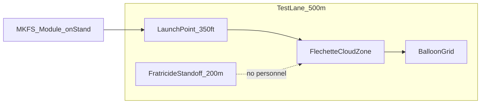

# MKFS Swarm Test Concept — Desk Exercise (T5)

**Status:** Concept | Phase 9
**Purpose:** T5 swarm surrogate and network-stress test concept.
**Key Decisions:** See [DECISIONS.md](DECISIONS.md)
**Open Questions:** See [RISK_REGISTER.md](RISK_REGISTER.md)

**Document ID:** MKFS-DOC-T5-001  
**Version:** 0.3 (Phase 9 hardening)  
**Scope:** Planning document only — **no hardware required** to produce this artifact  
**Related:** [TEST_EVAL_PLAN.md](TEST_EVAL_PLAN.md) | [SALVO_SCENARIOS.md](../research/ballistics/SALVO_SCENARIOS.md) | [FRATRICIDE_DECONFLICTION.md](FRATRICIDE_DECONFLICTION.md) | [NETWORK_ARCHITECTURE.md](NETWORK_ARCHITECTURE.md)

---

## 1. Purpose

Expand T5 (*System — Swarm surrogate engagement*) from a single table row into a **desk-exercise test concept** suitable for prime review, range planning, and demo film storyboarding.

---

## 2. Test Objective

Demonstrate that an MKFS **LAST_DITCH_FULL** salvo produces sufficient **terminal-band flechette density** to defeat a **multi-target swarm surrogate** at 250–400 ft without explosives or guided submunitions.

**Primary metric:** ≥ **300 hits/m²** in engagement volume at 350 ft *(achieved by 136-tube strip — see [SALVO_SCENARIOS.md](../research/ballistics/SALVO_SCENARIOS.md))*

**Secondary metrics:**

| Metric | Target | Path |
|--------|--------|------|
| Local cue-to-fire | **< 500 ms** | Tier 1 CAN commit path only |
| C4ISR-inclusive cue-to-fire | **< 2 s** | When C4ISR link healthy |
| Full salvo complete | **< 3 s** | 136 tubes @ 2 ms inter-tube, LAST_DITCH_FULL |
| Fratricide | Zero violations | Instrumented safety zone |

---

## 3. Surrogate Targets

| Target | Role | Count | Notes |
|--------|------|-------|-------|
| Commercial quadcopter (≤ 2 kg) | Primary swarm element | 8–12 | Autonomous pre-programmed approach |
| Helium balloon grid (1 m spacing) | Density witness | 20–40 | Records flechette passage |
| Tow plywood silhouette (1 m²) | Structural witness | 4 | Penetration / strike count |
| High-speed camera cloud zone | Pattern verification | 2 | Cross-range pattern diameter |

**Not required for desk exercise:** Live warhead proxies, explosive interceptors, or classified threat replicas.

---

## 4. Test Lanes

| Parameter | Value |
|-----------|-------|
| Engagement range | 300–400 ft (adjustable) |
| Elevation | 25–35° (FCU computed) |
| Lateral safety standoff | 200 m minimum from cloud center |
| Downrange clear | 600 m no-man zone |

Cross-reference elevation limits and dismount arcs in [FRATRICIDE_DECONFLICTION.md](FRATRICIDE_DECONFLICTION.md).

---

## 5. Pass / Fail Criteria

| ID | Criterion | Pass |
|----|-----------|------|
| T5-001 | Balloon grid strike rate | ≥ 80% balloons punctured in 24 ft pattern @ 350 ft |
| T5-002 | Quadcopter defeat | ≥ 6 of 8 drones down or non-flightworthy |
| T5-003 | Salvo density *(instrumented)* | ≥ 300 hits/m² in cloud zone |
| T5-004 | Fratricide | Zero strikes in inhibit arc / safety zone |
| T5-005 | Time to salvo complete | ≤ 3 s for 136-tube profile |

---

## 6. Demo Film Storyboard *(What a Prime Would Watch)*

| Shot | Content | Duration |
|------|---------|----------|
| 1 | Wide — MKFS strip on test stand, swarm approach | 5 s |
| 2 | FCU panel — ARMED → ENGAGING → LAST_DITCH_FULL | 3 s |
| 3 | Slow-mo — tube ripple, puck exit | 4 s |
| 4 | Cloud zone — balloon grid collapse | 5 s |
| 5 | IR overlay — pattern diameter overlay @ 350 ft | 4 s |
| 6 | Quadcopter falls — tally overlay | 4 s |
| 7 | Title card — hits/m², zero HE, kinetic only | 3 s |

**Total:** ~30 s sizzle reel + 2 min technical cut with instrument data.

---

## 7. Phased Execution Path

| Phase | Activity | Hardware |
|-------|----------|----------|
| **Desk** *(this doc)* | Criteria, layout, storyboard | None |
| T2 | Single-puck / small salvo ballistics | Range |
| T3 | 136-tube module + FCU HIL | Module + simulator |
| T5 | Full swarm surrogate | Module + targets |

---

## 10. Network-Stress Scenarios *(Desk Exercise)*

Per [NETWORK_ARCHITECTURE.md](NETWORK_ARCHITECTURE.md) §5 (quant baseline) and §6.4 (degradation ladder). FCU = vehicle **edge node**. No hardware required for desk pass/fail definition.

| ID | Scenario | Inject | Pass criteria |
|----|----------|--------|---------------|
| T5-N01 | C4ISR loss mid-engagement | Drop TCP/IP tracks at T+0.5 s | Salvo completes on local CAN tracks; Tier 1 path unaffected |
| T5-N02 | 250 ms track latency | Delay all CAN `0x300 TRACK` by 250 ms | `pattern_overlap_with_predictor` ≥ **0.894** — source: [`latency_resilience_output.json`](../scripts/latency_resilience_output.json) `baseline_reference` |
| T5-N03 | Sensor overload | 50 tracks, 32-cap sensor | Triage top-N by closure rate; FCU edge node does not fault |
| T5-N04 | Partial convoy gossip | 1 of 3 nodes loses C4ISR | Adjacent node shares tracks; fratricide uses conservative union (SI-010/011) |

### Failure modes

| Failure | Expected behavior (Degradation Level) |
|---------|--------------------------------------|
| TCP/IP retransmit storm | Tier 1 unaffected; Level 1 — last-known intent TTL |
| Central fusion overload | Tier 2 triage; no wait on central node |
| Stale track > 500 ms | Hold fire per ICD |
| Conflicting friendly position | Hold fire (SI-011) |

---

## 11. Link to TEST_EVAL_PLAN

This document **supplements** [TEST_EVAL_PLAN.md](TEST_EVAL_PLAN.md) § T5. Update T5 row on range execution to reference MKFS-DOC-T5-001.

---

## 12. Revision History

| Version | Date | Change |
|---------|------|--------|
| 0.1 | 2026-05-22 | Initial desk-exercise T5 concept |
| 0.2 | 2026-05-22 | Phase 9 — network-stress scenarios T5-N01–N04; split local vs C4ISR latency metrics |
| 0.3 | 2026-05-22 | Hardening — Tier 1/2 terminology, JSON field traceability for T5-N02 |
