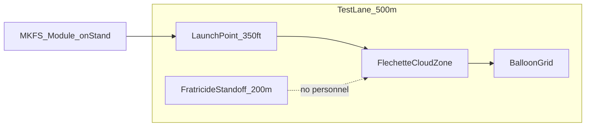

# MKFS Swarm Test Concept — Desk Exercise (T5)

**Document ID:** MKFS-DOC-T5-001  
**Version:** 0.1 (Phase 5)  
**Scope:** Planning document only — **no hardware required** to produce this artifact  
**Related:** [TEST_EVAL_PLAN.md](TEST_EVAL_PLAN.md) | [SALVO_SCENARIOS.md](../research/ballistics/SALVO_SCENARIOS.md) | [FRATRICIDE_DECONFLICTION.md](FRATRICIDE_DECONFLICTION.md)

---

## 1. Purpose

Expand T5 (*System — Swarm surrogate engagement*) from a single table row into a **desk-exercise test concept** suitable for prime review, range planning, and demo film storyboarding.

---

## 2. Test Objective

Demonstrate that an MKFS **LAST_DITCH_FULL** salvo produces sufficient **terminal-band flechette density** to defeat a **multi-target swarm surrogate** at 250–400 ft without explosives or guided submunitions.

**Primary metric:** ≥ **300 hits/m²** in engagement volume at 350 ft *(achieved by 136-tube strip — see [SALVO_SCENARIOS.md](../research/ballistics/SALVO_SCENARIOS.md))*

**Secondary metrics:**
- Time from cue to first tube fire: **< 2 s**
- Full salvo complete: **< 3 s** (136 tubes @ 5 ms inter-tube)
- Zero fratricide violations in instrumented safety zone

---

## 3. Surrogate Targets

| Target | Role | Count | Notes |
|--------|------|-------|-------|
| Commercial quadcopter (≤ 2 kg) | Primary swarm element | 8–12 | Autonomous pre-programmed approach |
| Helium balloon grid (1 m spacing) | Density witness | 20–40 | Records flechette passage |
| Tow plywood silhouette (1 m²) | Structural witness | 4 | Penetration / strike count |
| High-speed camera cloud zone | Pattern verification | 2 | Cross-range pattern diameter |

**Not required for desk exercise:** Live warhead proxies, explosive interceptors, or classified threat replicas.

---

## 4. Test Lanes

| Parameter | Value |
|-----------|-------|
| Engagement range | 300–400 ft (adjustable) |
| Elevation | 25–35° (FCU computed) |
| Lateral safety standoff | 200 m minimum from cloud center |
| Downrange clear | 600 m no-man zone |

Cross-reference elevation limits and dismount arcs in [FRATRICIDE_DECONFLICTION.md](FRATRICIDE_DECONFLICTION.md).

---

## 5. Pass / Fail Criteria

| ID | Criterion | Pass |
|----|-----------|------|
| T5-001 | Balloon grid strike rate | ≥ 80% balloons punctured in 24 ft pattern @ 350 ft |
| T5-002 | Quadcopter defeat | ≥ 6 of 8 drones down or non-flightworthy |
| T5-003 | Salvo density *(instrumented)* | ≥ 300 hits/m² in cloud zone |
| T5-004 | Fratricide | Zero strikes in inhibit arc / safety zone |
| T5-005 | Time to salvo complete | ≤ 3 s for 136-tube profile |

---

## 6. Demo Film Storyboard *(What a Prime Would Watch)*

| Shot | Content | Duration |
|------|---------|----------|
| 1 | Wide — MKFS strip on test stand, swarm approach | 5 s |
| 2 | FCU panel — ARMED → ENGAGING → LAST_DITCH_FULL | 3 s |
| 3 | Slow-mo — tube ripple, puck exit | 4 s |
| 4 | Cloud zone — balloon grid collapse | 5 s |
| 5 | IR overlay — pattern diameter overlay @ 350 ft | 4 s |
| 6 | Quadcopter falls — tally overlay | 4 s |
| 7 | Title card — hits/m², zero HE, kinetic only | 3 s |

**Total:** ~30 s sizzle reel + 2 min technical cut with instrument data.

---

## 7. Phased Execution Path

| Phase | Activity | Hardware |
|-------|----------|----------|
| **Desk** *(this doc)* | Criteria, layout, storyboard | None |
| T2 | Single-puck / small salvo ballistics | Range |
| T3 | 136-tube module + FCU HIL | Module + simulator |
| T5 | Full swarm surrogate | Module + targets |

---

## 8. Link to TEST_EVAL_PLAN

This document **supplements** [TEST_EVAL_PLAN.md](TEST_EVAL_PLAN.md) § T5. Update T5 row on range execution to reference MKFS-DOC-T5-001.

---

## 9. Revision History

| Version | Date | Change |
|---------|------|--------|
| 0.1 | 2026-05-22 | Initial desk-exercise T5 concept |
