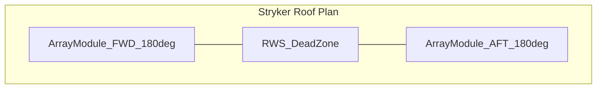
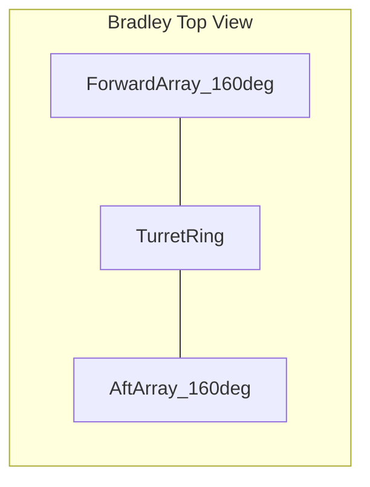
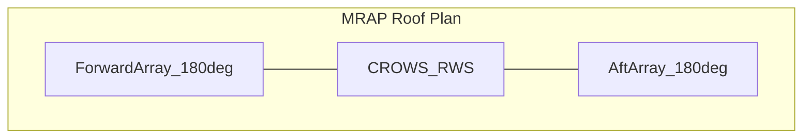

# MKFS Vehicle Integration Matrix

**Document ID:** MKFS-DOC-VINT-001  
**Version:** 0.1 (Phase 0)  
**Related:** [REQUIREMENTS.md](REQUIREMENTS.md) | [DEPLOYMENT_MECHANISM.md](DEPLOYMENT_MECHANISM.md) | [SYSTEM_ARCHITECTURE.md](architecture/SYSTEM_ARCHITECTURE.md) | [adapters/README.md](adapters/README.md) | [current_tasks.md](../tasks/current_tasks.md)

---

## 1. Purpose

Define how MKFS **tiles** mount on each platform — **turret cheeks, hull sides, and low-profile roof** — not only roof boxes. Tiles are 2×1 / 3×1 ft strips laid flush like APS panels.

**Read first:** [DESIGN_PHILOSOPHY.md](DESIGN_PHILOSOPHY.md)

**Assumption note:** Vehicle dimensions and roof load limits are based on publicly available specifications. Values marked *(assumed)* require verification against TM/engineering data during Phase 3.

---

## 2. Integration Summary Matrix

| Platform | Primary mount faces | Example tile layout *(ft)* | Tubes (example) | Profile |
|----------|---------------------|----------------------------|-----------------|---------|
| Stryker ICV/CV | Turret bustle + hull sides | two **3×1 ft** bustle + two **2×1 ft** hull | ~90 | ≤ 150 mm |
| Stryker MGS | Hull sides (gun arc) | two **2×1 ft** per side | ~36 | ≤ 150 mm |
| M2 Bradley | **Turret cheeks** + bustle | two **3×1 ft** cheek + one **3×1 ft** bustle | ~81 | ≤ 150 mm |
| M113 | Hull sides | two **2×1 ft** stacked × both sides | ~72 | ≤ 150 mm |
| LAV-25 | Roof corners + hull | four **2×1 ft** | ~72 | ≤ 150 mm |
| MRAP MaxxPro | Hull long sides | 2 tube-rows of six **3×1 ft** tiles | ~324 | ≤ 150 mm |
| Recon / light | Corners / cheeks | one–two **2×1 ft** | ~18–36 | ≤ 150 mm |

*Tube counts scale by mission; electronic FCU addresses each tube individually.*

### Legacy matrix (superseded footprint labels)

| Platform | Adapter Kit | Notes |
|----------|-------------|-------|
| Stryker ICV/CV | `MKFS-ADP-STRYKER-A` | Bustle + hull tiles, not roof towers |
| Stryker MGS | `MKFS-ADP-STRYKER-A` | Hull-side compact strips |
| M2 Bradley | `MKFS-ADP-BRADLEY-A` | **Turret cheek** priority |
| M113 | `MKFS-ADP-M113-A` | Hull side vertical stacks |
| LAV-25 | `MKFS-ADP-LAV25-A` | Low roof + amphib stow |
| MRAP | `MKFS-ADP-MRAP-A` | High tube count hull runs — 2×100+ feasible |

---

## 3. Platform Detail

### 3.1 Stryker Family (8×8 Wheeled)

**Variants:** ICV, CV, MGS, and related configurations  
**Adapter Kit:** `MKFS-ADP-STRYKER-A`

#### Mounting Surfaces

- Primary: Flat roof sections fore and aft of turret/remote weapon station
- ICV/CV: Ample roof area; standard-tier arrays on 200 mm risers clear RWS sweep
- MGS: Aft roof constrained by 105 mm gun arc; compact-tier arrays on port/starboard sponson-adjacent roof sections

#### Constraints

| Parameter | ICV/CV | MGS |
|-----------|--------|-----|
| Max roof height add | 450 mm | 350 mm |
| CG shift limit | ≤ 50 mm lateral, ≤ 30 mm vertical | Same |
| Clearance (RWS/gun) | 360° RWS dead zone ~60° aft *(assumed)* | Gun arc priority — arrays outside arc |

#### Power and Data

- Tap: Vehicle 28 VDC bus via standard NATO socket or hardwired adapter harness
- Draw: 150 W per module (300 W dual-array peak during salvo)
- FCU integration: C4ISR data bus (Ethernet or MIL-STD-1553 bridge — Phase 3)

#### Dual-Array Layout (ICV/CV)

- Forward module: covers 000°–180° (relative bow)
- Aft module: covers 180°–360°
- Overlap: ±15° at beam for seam coverage

#### Sensor Integration

- Existing RWS EO/IR for cueing
- Optional: Dedicated short-range radar (e.g., compact AESA) on adapter mast — Phase 3

---

### 3.2 M2 Bradley (Tracked IFV)

**Adapter Kit:** `MKFS-ADP-BRADLEY-A`

#### Mounting Surfaces

- Forward: Roof section forward of TOW launcher / commander hatch
- Aft: Engine deck roof aft of turret ring
- Riser height: 250 mm to clear TOW pod and commander cupola rotation

#### Constraints

| Parameter | Value |
|-----------|-------|
| Roof usable area | ~2.0 × 2.5 m *(assumed)* |
| Max combined mass | 110 kg |
| Turret ring interference | Arrays mounted outside 1.5 m diameter ring *(assumed)* |

#### Power and Data

- 28 VDC from Bradley electrical system; 300 W allocated
- FCU mounts in troop compartment or turret bustle (Phase 3 packaging study)

#### Dual-Array Layout

- Forward array: bow arc 330°–150°
- Aft array: stern arc 150°–330°
- Overlap at quarters (±20°)

#### Notes

- Bradley's existing 25 mm chain gun and TOW occupy upper hemisphere; MKFS arrays pitched +15° default to clear friendly fire arcs
- Tracked platform: adapter plate includes shock isolation for cross-country vibration

---

### 3.3 M113 (Tracked APC)

**Adapter Kit:** `MKFS-ADP-M113-A`

#### Mounting Surfaces

- Mid-roof port and starboard of commander's hatch
- Limited roof area — compact-tier arrays only
- Low-profile mount (150 mm riser) to preserve vehicle height for air transport

#### Constraints

| Parameter | Value |
|-----------|-------|
| Roof usable area | ~2.2 × 2.8 m *(assumed)* |
| Electrical | 24 VDC legacy; DC-DC converter to 28 V for FCU *(assumed)* |
| Max combined mass | 85 kg (aging suspension — conservative limit) |

#### Dual-Array Layout

- Port module: 270°–090°
- Starboard module: 090°–270°
- Overlap at bow and stern (±25°)

#### Notes

- Oldest platform — adapter kit emphasizes minimal roof penetration and bolt-on-only installation
- May require structural reinforcement plate under roof skin (Phase 3 analysis)

---

### 3.4 LAV-25 (8×8 Wheeled, USMC)

**Adapter Kit:** `MKFS-ADP-LAV25-A`

#### Mounting Surfaces

- Fore and aft roof sections flanking M242 Bushmaster turret
- Compact-tier arrays on streamlined fairings to limit drag signature

#### Constraints

| Parameter | Value |
|-----------|-------|
| Roof usable area | ~2.0 × 2.4 m *(assumed)* |
| Max height add | 300 mm (amphibious ops clearance concern) |
| Mass limit | 85 kg combined |

#### Power and Data

- 28 VDC; 250 W budget
- Integration with LAV digital architecture (Phase 3)

#### Dual-Array Layout

- Forward: 000°–180°
- Aft: 180°–360°
- Amphibious mode: Arrays stowed flat (+5° max elevation) via quick-release pins *(Phase 3 mechanism)*

---

### 3.5 MRAPs (MaxxPro, RG-31, Similar)

**Adapter Kit:** `MKFS-ADP-MRAP-A` (sub-variants for roof profile differences)

#### Mounting Surfaces

- Large flat roof — ideal for dense-tier arrays
- MaxxPro: Fore/aft of RWS on raised roof section
- RG-31: Similar fore/aft layout; slightly narrower roof uses standard tier

#### Constraints

| Parameter | MaxxPro | RG-31 |
|-----------|---------|-------|
| Roof area | ~2.5 × 3.2 m *(assumed)* | ~2.3 × 2.8 m *(assumed)* |
| Array tier | Dense (36-tube) | Standard (25-tube) |
| Mass limit | 130 kg | 105 kg |
| Riser | 300 mm (V-hull roof step) | 250 mm |

#### Power and Data

- 28 VDC, 350 W (MaxxPro) / 300 W (RG-31)
- Convoy protection mission profile — priority on rapid salvo and large magazine depth

#### Dual-Array Layout

- Highest capacity configuration in MKFS family
- Optional third compact module (stern spare) for rear convoy protection — out of baseline scope, noted for Phase 4

---

## 4. Scalable Array Sizing

| Tier | Tube Count | Module Face | Typical Platforms |
|------|------------|-------------|-------------------|
| Compact | 16 | 610 × 610 mm | M113, LAV-25, Stryker MGS |
| Standard | 25 | 610 × 610 mm | Stryker ICV/CV, Bradley, RG-31 |
| Dense | 36 | 610 × 610 mm | MaxxPro, future heavy platforms |

All tiers share **MKFS-IF-002** mounting face and **MKFS-IF-001** cartridge interface.

---

## 5. Common Integration Requirements

### 5.1 Adapter Plate (MKFS-IF-003)

All platforms use the standard 800 × 800 mm adapter plate with 700 mm bolt pattern. Platform-specific risers and fairings attach to this plate.

### 5.2 Fire Control Unit (FCU)

- One FCU per vehicle, controlling both array modules
- FCU receives threat cueing from vehicle sensors or optional dedicated swarm radar
- FCU output: tube select, salvo timing, reload status — via MKFS-IF-004

### 5.3 Power

| Component | Draw |
|-----------|------|
| FCU (idle) | 25 W |
| FCU (salvo active) | 80 W |
| Array module (per unit, peak) | 150 W |
| Dual-array peak | 300–350 W |

### 5.4 Weight and Center of Gravity

- Target CG shift: ≤ 50 mm lateral, ≤ 40 mm vertical after installation
- Phase 3: Per-platform static and dynamic stability analysis required

### 5.5 Sensor Integration Points

| Sensor Source | Function | Phase |
|---------------|----------|-------|
| Vehicle RWS EO/IR | Visual/IR cueing | Baseline |
| Vehicle radar (if equipped) | Track cueing | Optional |
| Dedicated swarm sensor | Autonomous cueing | Phase 3 optional kit |

---

## 6. Installation Concept

1. Mount adapter plate to roof using existing tie-down or reinforced bolt pattern
2. Install riser and fairing (platform-specific sub-kit)
3. Attach array modules to adapter plate (MKFS-IF-002)
4. Connect power/data harness (MKFS-IF-004)
5. Install FCU and integrate with vehicle power and C4ISR
6. Load quick-swap pods; verify tube alignment and band index settings

Estimated installation time: 4–8 hours per vehicle (Phase 3 validation target).

Detailed drawing sets: [adapters/README.md](adapters/README.md)

---

## 7. Open Items (Phase 3)

| Item | Platform | Action |
|------|----------|--------|
| Roof load verification | M113 | Structural analysis |
| Amphibious stow mechanism | LAV-25 | Design and test |
| MGS gun arc clearance | Stryker MGS | Live-fire clearance check |
| 24 VDC conversion | M113 | DC-DC converter qualification |
| C4ISR protocol mapping | All | Interface control document |

---

## 8. Revision History

| Version | Date | Change |
|---------|------|--------|
| 0.1 | 2026-05-22 | Phase 0 initial vehicle matrix |
