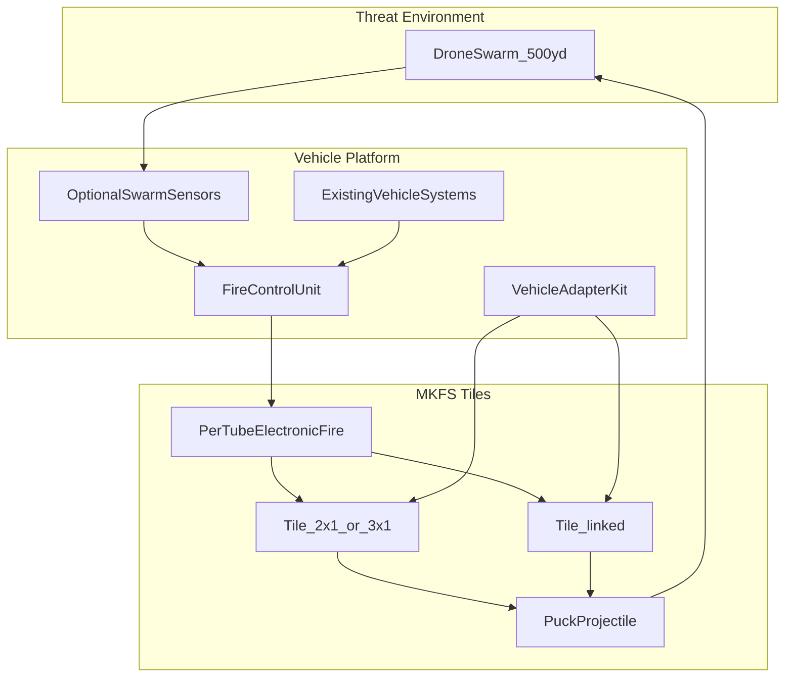
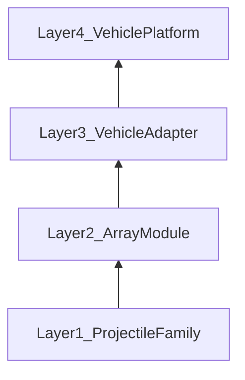
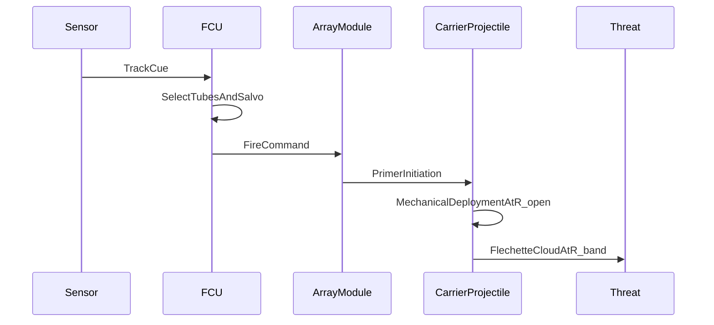

# MKFS System Architecture

**Document ID:** MKFS-DOC-ARCH-001  
**Version:** 0.2  
**Related:** [DESIGN_PHILOSOPHY.md](../DESIGN_PHILOSOPHY.md) | [REQUIREMENTS.md](../REQUIREMENTS.md) | [VEHICLE_INTEGRATION.md](../VEHICLE_INTEGRATION.md) | [DEPLOYMENT_MECHANISM.md](../DEPLOYMENT_MECHANISM.md)

---

## 1. Purpose

Define the system-level architecture for MKFS, including subsystems, modularity layers, control boundaries, and the relationship between vehicle platform, launcher, and kinetic projectile.

---

## 2. System Context

MKFS is a **last-ditch terminal defense** layer — APS-analogue for drone swarms. Low-profile **tiles** on turret/hull/roof; **electronic per-tube fire**; **half-dollar pucks**. See [DESIGN_PHILOSOPHY.md](../DESIGN_PHILOSOPHY.md).

---

## 3. Subsystems

### 3.1 Effector — Tile Launcher

Low-profile **symmetrical tiles** (2×1, 3×1 ft) mounted on turret cheeks, hull sides, roofs.

| Attribute | Baseline Specification |
|-----------|------------------------|
| Baseline tile | 2×1 ft (610 × 305 mm), **≤ 150 mm** tall |
| Tubes per 2×1 | ~18 (35 mm pitch, 31 mm puck) |
| Scale | Edge-link tiles; **2 rows × 100+** tubes |
| Mount | Conformal plate — cheek, hull, roof |
| Initiation | **Electronic per-tube** — core capability |
| Reload | Row strip or tile reload |

**Function:** Addressable volume fire — sector, ripple, or `LAST_DITCH_FULL` dump.

### 3.2 Projectile — Puck Carrier

**Half-dollar class** short puck (~31 × 28 mm), not a rifle cartridge.

| Attribute | Baseline Specification |
|-----------|------------------------|
| Designation | `MKFS-CART-PUCK` |
| Size | 31 mm dia × 28 mm |
| Mass | 55–75 g |
| Flechettes | ~35 × Ti per puck |
| Deployment | Option D setback (scaled) |
| Guidance | None |

**Function:** Deliver flechette cloud to preset range band (`R_open` ~200 ft, peak `R_band` 250–500 ft).

### 3.3 Fire Control Unit (FCU)

Launcher-level electronics for engagement sequencing. **No fire control inside the round.**

| Function | Description |
|----------|-------------|
| Threat cueing | Receives tracks from vehicle sensors or optional swarm radar |
| Tube selection | Selects tubes for salvo pattern |
| Salvo timing | Sequences initiation with programmable inter-round delay |
| Safety | Arming interlocks, muzzle clearance check, friendly-fire zone inhibit |
| Status | Pod round count, module health, fault reporting |

**Interface:** MKFS-IF-004 (28 VDC, RS-485/CAN data)

### 3.4 Vehicle Adapter Kit

Platform-specific mounting hardware bridging vehicle roof to array module.

| Attribute | Specification |
|-----------|---------------|
| Standard plate | MKFS-IF-003 (800 × 800 mm) |
| Kit IDs | `MKFS-ADP-STRYKER-A`, `MKFS-ADP-BRADLEY-A`, `MKFS-ADP-M113-A`, `MKFS-ADP-LAV25-A`, `MKFS-ADP-MRAP-A` |
| Risers / fairings | Platform-specific sub-components |

**Function:** Provide structural mount, power pass-through, and CG management without permanent hull modification.

### 3.5 Sensors (Optional)

| Source | Role | Integration |
|--------|------|-------------|
| Vehicle RWS EO/IR | Visual cueing | FCU video/track input |
| Vehicle radar | Track cueing | FCU track message |
| Dedicated swarm sensor | Autonomous detection | Phase 3 optional kit on adapter mast |

Sensors cue the FCU; they do not interact with the projectile.

---

## 4. Modularity Layers

| Layer | Component | Interface | Scales By |
|-------|-----------|-----------|-----------|
| 1 — Projectile | Carrier + flechettes | MKFS-IF-001 | Band index, flechette count |
| 2 — Array | Multi-tube module + pod | MKFS-IF-002 | Tube tier (compact/standard/dense) |
| 3 — Adapter | Plate, riser, fairing | MKFS-IF-003 | Platform envelope |
| 4 — Platform | Vehicle | MKFS-IF-004 + C4ISR | Mission configuration |

**Core principle:** Layer 1 and Layer 2 are identical across all vehicles. Only Layer 3 changes per platform.

---

## 5. Control and Data Boundaries

Strict separation between mechanical (round) and electronic (launcher/vehicle) domains:

| Boundary | Electronic Side | Mechanical Side |
|----------|-----------------|-----------------|
| Initiation | FCU sends fire command → module applies primer current | Primer ignites propellant; setback drives deployment |
| Range band | Not controlled electronically | Band index set at load time (MKFS-IF-001) |
| Guidance | N/A | Unguided ballistic + mechanical dispersal |
| Status | Round count, module faults | No telemetry from round |

---

## 6. Engagement Sequence

1. Sensor detects and tracks swarm element
2. FCU computes engagement solution (azimuth, elevation, salvo size)
3. FCU selects tubes and programs inter-round delay
4. Module initiates selected rounds (electric primer)
5. Carrier travels ballistically; mechanical deployment at `R_open`
6. Flechette cloud disperses; peak effect in `R_band`

---

## 7. Dual-Array 360° Coverage

Preferred configuration: two array modules per vehicle.

| Module | Coverage Arc | Overlap |
|--------|--------------|---------|
| A (forward/port) | ~180° | ±15°–25° with Module B at quarters |
| B (aft/starboard) | ~180° | Seam coverage against single-module blind spots |

FCU coordinates both modules; can fire same-side or cross-body salvos. See [VEHICLE_INTEGRATION.md](../VEHICLE_INTEGRATION.md) for per-platform layouts.

---

## 8. Phase 1 Ballistics Modeling Scope

Initial modeling in `research/ballistics/` (Phase 1):

| Model Element | Assumption |
|---------------|------------|
| Carrier trajectory | Point mass with G1/G7 drag |
| `V_0` | 900 m/s baseline; ±5% sensitivity |
| Elevation | 30° nominal |
| Deployment | Instantaneous release at `R_open` |
| Flechette dispersion | Conical spread, half-angle 8°–12° |
| Pattern metric | Hits per m² vs. range |

**Output:** Pattern diameter and density curves for 250–500 ft band; input to array salvo sizing.

---

## 9. Array Module Tier Comparison

| Tier | Tubes | Salvo (1 sec) | Pod Mass | Platforms |
|------|-------|---------------|----------|-----------|
| Compact | 16 | 8–16 rounds | ~35 kg | M113, LAV-25, Stryker MGS |
| Standard | 25 | 12–25 rounds | ~45 kg | Stryker ICV, Bradley, RG-31 |
| Dense | 36 | 18–36 rounds | ~55 kg | MaxxPro |

Salvo rate limited by FCU sequencing and thermal management (Phase 2 detail).

---

## 10. Forward Work

| Phase | Architecture Deliverable |
|-------|-------------------------|
| **1** | Carrier projectile ICD; ballistics model; deployment validation |
| **2** | Array module detailed design; FCU software architecture; pod ICD |
| **3** | Per-platform adapter drawings; sensor integration ICD; dual-array fire plans |
| **4** | MKFS-DOC-SPEC-001 full system spec; risk register; test architecture |

---

## 11. Revision History

| Version | Date | Change |
|---------|------|--------|
| 0.1 | 2026-05-22 | Phase 0 initial system architecture |
