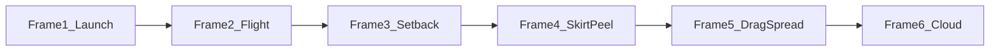
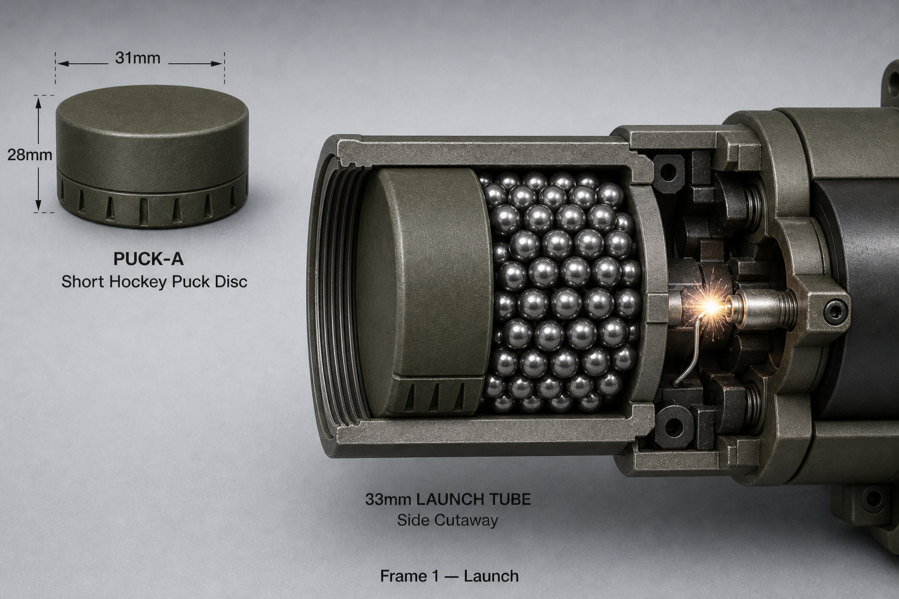
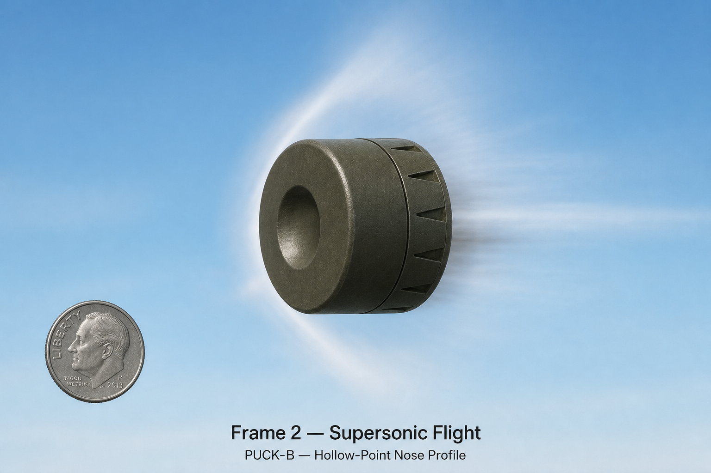
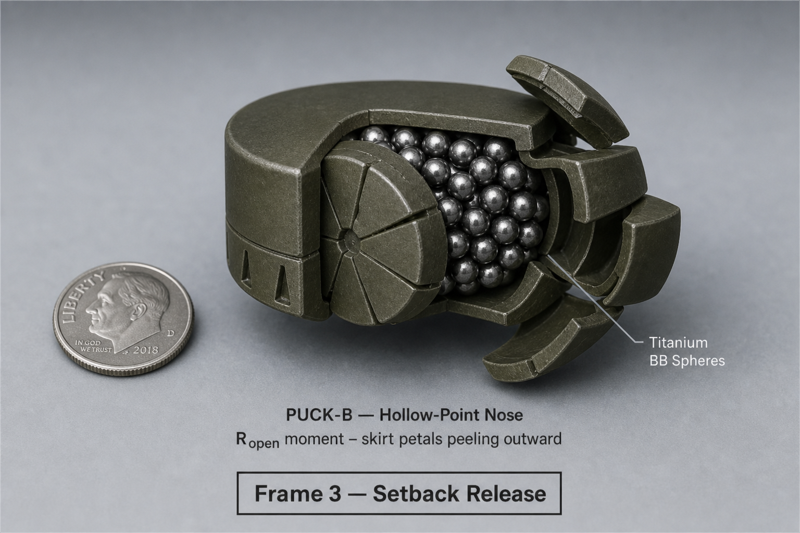
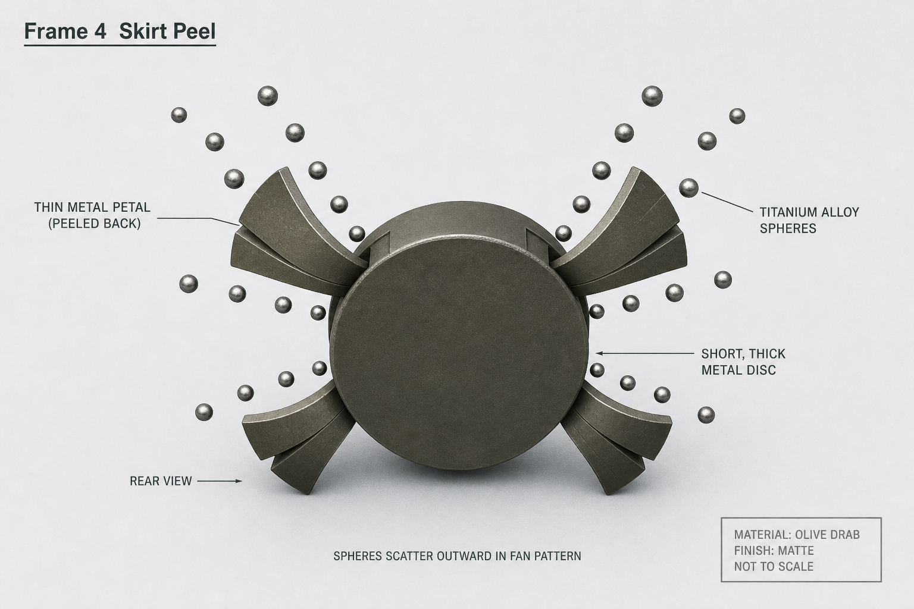
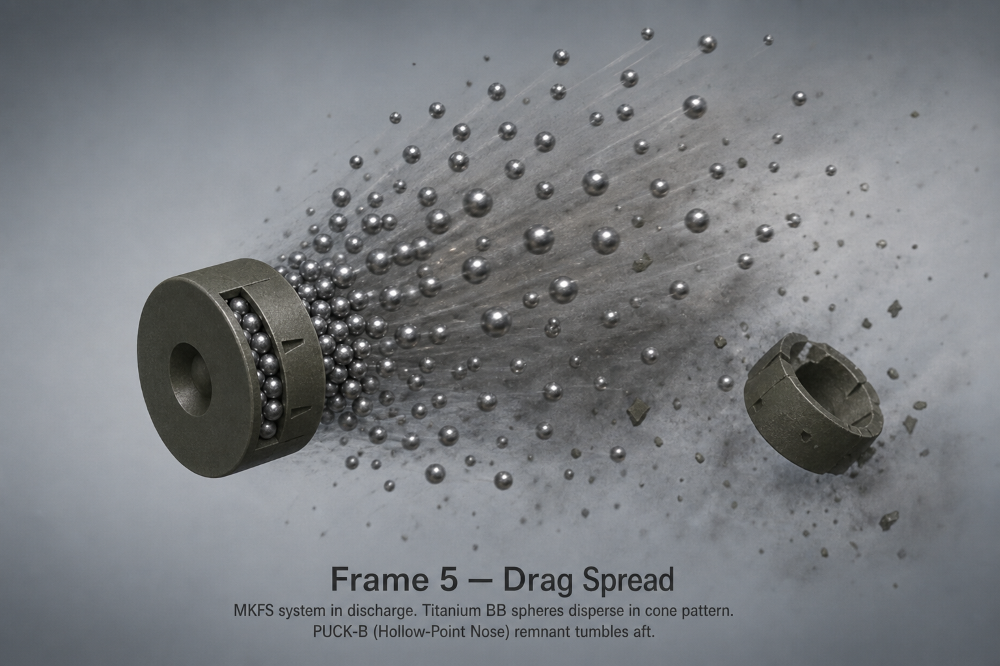
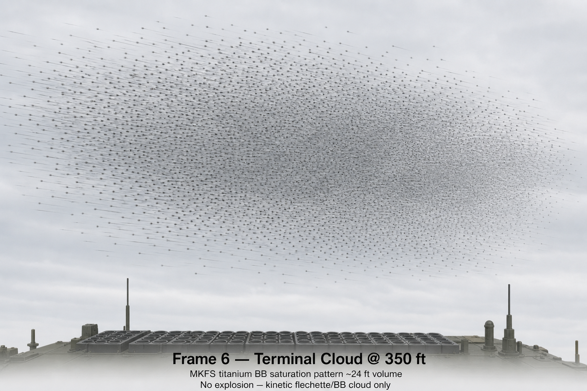

# MKFS Puck Cutaway Storyboard

**Document ID:** MKFS-VIS-STORY-001  
**Version:** 0.3 (Phase 8)  
**Related:** [PUCK_RELEASE.md](../PUCK_RELEASE.md) | [CARRIER_PROJECTILE_ICD.md](../CARRIER_PROJECTILE_ICD.md) | [PUCK_DESIGN_OPTIONS.md](../../assets/PUCK_DESIGN_OPTIONS.md)

---

## 1. Purpose

Frame-by-frame storyboard for hollow-point puck release — for illustrators, animators, and range camera placement.

**Canonical puck forms (D-011):** **PUCK-A** (Standard Drum) for tube/chamber views; **PUCK-B** (Hollow-Point Nose) for peel sequence and cutaways.

---

## 2. Reference Render

From [mkfs_puck_design_comparison_4up.png](../../assets/mkfs_puck_design_comparison_4up.png) — use **A** and **B** in all new art.

---

## 3. Puck Key Dimensions

From [CARRIER_PROJECTILE_ICD.md](../CARRIER_PROJECTILE_ICD.md):

| Dimension | Value |
|-----------|-------|
| Diameter | 31 mm |
| Length | 28 mm |
| Mass | ~63 g |
| Payload | ~40 **titanium BBs** (Ti-6Al-4V) |

---

## 4. Timeline

---

## 5. Frame Renders

### Combined storyboard

### Frame 1 — Launch (t = 0 ms)

**View:** Side cutaway, tube chamber  
**Puck form:** **PUCK-A** (Standard Drum) in tube  
**Action:** Electric primer fires; puck accelerates; setback loads nose/skirt interface  
**Callouts:** 31 mm diameter, 850–950 m/s muzzle velocity  
**Art note:** **Titanium BBs** stacked inside skirt cavity, nose ogive intact  

---

### Frame 2 — Supersonic flight (t = 20–80 ms)

**View:** External side, no cutaway  
**Puck form:** **PUCK-B** (Hollow-Point Nose) profile  
**Action:** Puck stable; skirt latch holds; air flow over ogive  
**Callouts:** ~200 ft to R_open  
**Art note:** Minimal vapor trail; no HE flash  

---

### Frame 3 — Setback release (t = 78 ms / R_open)

**View:** Cutaway side + front quarter  
**Puck form:** **PUCK-B** cutaway  
**Action:** Setback force exceeds latch; skirt begins radial peel  
**Callouts:** T_release = 0.078 s mechanical; R_open ≈ 200 ft  
**Art note:** Skirt petals mid-flex — strain visible at score lines; **titanium BBs** visible in cavity  

---

### Frame 4 — Skirt peel (t = 80–120 ms)

**View:** Front orthographic + side  
**Puck form:** **PUCK-B** opening  
**Action:** Skirt petals fully open; titanium BBs begin radial ejection  
**Callouts:** Hollow-point geometry — opens from front  
**Art note:** 4–6 petal segments; no explosive burst  

---

### Frame 5 — Drag spread (t = 120–200 ms)

**View:** 3/4 perspective, cloud forming  
**Action:** Light BBs decelerate faster; heavy continue forward  
**Callouts:** Drag differential spreads cloud; ~3.3° half-angle cone  
**Art note:** Streak lines for BB paths; puck body tumbles aft  

---

### Frame 6 — Terminal cloud (t = 200 ms+, at target range)

**View:** Wide — target volume at 350 ft  
**Action:** Cloud ~24 ft diameter; saturation pattern  
**Callouts:** ~40 titanium BBs per puck; tile salvo density per [BALLISTICS_RESULTS.md](../../research/ballistics/BALLISTICS_RESULTS.md)  
**Art note:** Abstract density heatmap overlay optional  

---

## 6. Frame Descriptions *(Text Reference)*

### Frame 1 — Launch (t = 0 ms)

**View:** Side cutaway, tube chamber  
**Puck form:** **PUCK-A** (Standard Drum) in tube  
**Action:** Electric primer fires; puck accelerates; setback loads nose/skirt interface  
**Callouts:** 31 mm diameter, 850–950 m/s muzzle velocity  
**Art note:** Show **titanium BBs** stacked inside skirt cavity, nose ogive intact  

---

### Frame 2 — Supersonic flight (t = 20–80 ms)

**View:** External side, no cutaway  
**Puck form:** **PUCK-B** (Hollow-Point Nose) profile  
**Action:** Puck stable; skirt latch holds; air flow over ogive  
**Callouts:** ~200 ft to R_open  
**Art note:** Minimal vapor trail; no HE flash  

---

### Frame 3 — Setback release (t = 78 ms / R_open)

**View:** Cutaway side + front quarter  
**Puck form:** **PUCK-B** cutaway  
**Action:** Setback force exceeds latch; skirt begins radial peel  
**Callouts:** T_release = 0.078 s mechanical; R_open ≈ 200 ft  
**Art note:** Skirt petals mid-flex — strain visible at score lines; **titanium BBs** visible in cavity  

---

### Frame 4 — Skirt peel (t = 80–120 ms)

**View:** Front orthographic + side  
**Puck form:** **PUCK-B** opening  
**Action:** Skirt petals fully open; titanium BBs begin radial ejection  
**Callouts:** Hollow-point geometry — opens from front  
**Art note:** 4–6 petal segments; no explosive burst  

---

### Frame 5 — Drag spread (t = 120–200 ms)

**View:** 3/4 perspective, cloud forming  
**Action:** Light BBs decelerate faster; heavy continue forward  
**Callouts:** Drag differential spreads cloud; ~3.3° half-angle cone  
**Art note:** Streak lines for BB paths; puck body tumbles aft  

---

### Frame 6 — Ti BB cloud (t = 200 ms+, at target range)

**View:** Wide — target volume at 350 ft  
**Action:** Cloud ~24 ft diameter; saturation pattern  
**Callouts:** ~40 titanium BBs per puck; tile salvo density per [BALLISTICS_RESULTS.md](../../research/ballistics/BALLISTICS_RESULTS.md)  
**Art note:** Abstract density heatmap overlay optional  

---

## 7. Camera / Instrument Placement (Range)

| Camera | Frame | Purpose |
|--------|-------|---------|
| High-speed side | 3–4 | Skirt peel timing |
| Front ortho | 4–5 | Pattern origin |
| Downrange wide | 6 | Cloud diameter at 350 ft |

---

## 8. Revision History

| Version | Date | Change |
|---------|------|--------|
| 0.1 | 2026-05-22 | Initial puck cutaway storyboard |
| 0.2 | 2026-05-22 | D-011 — PUCK-A/B canonical; embed 4-up render; titanium BBs language |
| 0.3 | 2026-05-22 | Phase 8 — 6 frame PNGs + 6-up storyboard sheet embedded |
