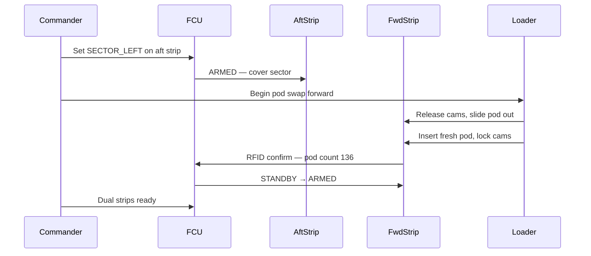

# MKFS Reload Under Fire — Concept

**Document ID:** MKFS-VIS-RELOAD-001  
**Version:** 0.1 (Phase 5)  
**Related:** [POD_MECHANISM_SPEC.md](../../prototypes/array/POD_MECHANISM_SPEC.md) | [CONOPS_VIGNETTES.md](../CONOPS_VIGNETTES.md) | [MAGAZINE_ECONOMICS.md](../MAGAZINE_ECONOMICS.md)

---

## 1. Purpose

Operational sequence and **render brief** for pod swap while remaining MKFS assets provide sector coverage. Text-only — no PNG in this sprint.

---

## 2. Scenario Baseline

**Platform:** Stryker ICV, dual 2×1 strips (forward + aft)  
**State:** Forward pod **empty** after Vignette 1 salvo; aft pod **partial** (~40 tubes)  
**Threat:** Possible second wave from same sector  

---

## 3. Crew Roles

| Role | Responsibility |
|------|----------------|
| **Commander** | Threat watch; authorizes reload; selects cover sector on FCU |
| **Gunner / loader** | Pod swap on empty module |
| **Driver** | Holds hull position / slow crawl if required |

---

## 4. Reload Sequence

| Step | Action | Time |
|------|--------|------|
| 1 | Commander sets aft strip to **SECTOR_LEFT** — covers threat arc | 5 s |
| 2 | FCU transitions forward strip to **RELOAD** — tubes de-energized | 2 s |
| 3 | Loader releases 4 over-center cams ([POD_MECHANISM_SPEC.md](../../prototypes/array/POD_MECHANISM_SPEC.md)) | 30 s |
| 4 | Slide empty pod out rails; insert fresh pod | 90 s |
| 5 | Alignment pins engage; cams lock; RFID tag read | 20 s |
| 6 | FCU: RELOAD → STANDBY → ARMED on forward strip | 10 s |
| **Total** | | **~2.5 min** *(under 5 min target)* |

---

## 5. Cover Geometry

While forward strip is in RELOAD:

- **Aft strip** maintains **SECTOR_** mask on threat bearing  
- FCU blocks forward strip fire (SI-004 pod removed)  
- If threat closes before swap complete → abort reload, **LAST_DITCH_FULL** from aft strip only  

---

## 6. Render Brief *(Future Asset)*

### Shot list

| # | Angle | Content |
|---|-------|---------|
| 1 | Wide elevation | Stryker hull, smoke/dust, aft strip firing (muzzle flash ripple) |
| 2 | Medium | Loader at forward strip, hands on cam levers |
| 3 | Insert | Fresh pod on rails — tube grid visible, 2×1 ft face |
| 4 | FCU insert | Panel shows RELOAD → ARMED, tube count 136 |
| 5 | Wide | Dual strips armed — overlay "272 tubes ready" |

### Callouts for illustrator

- Thin appliqué tile — not box launcher  
- Dense tube grid on pod face  
- Quick-swap rails visible on module shell  
- Spare pod on ground beside vehicle  

### Mood

Urgent but controlled — not panic. Last-ditch professionalism.

---

## 7. Revision History

| Version | Date | Change |
|---------|------|--------|
| 0.1 | 2026-05-22 | Initial reload-under-fire concept |
