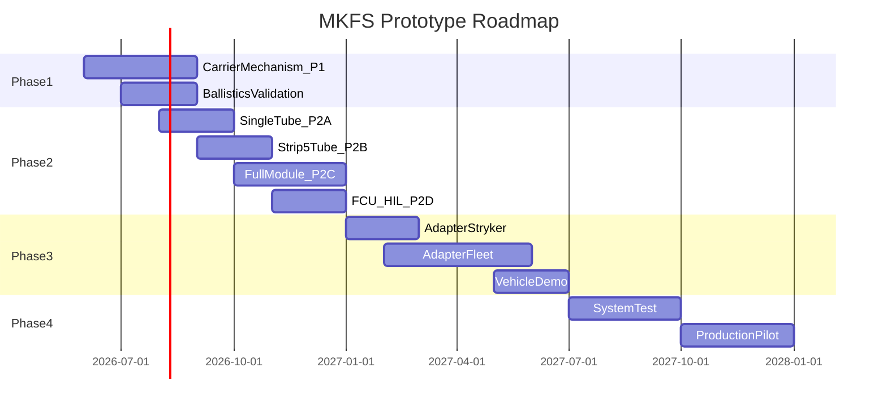

# MKFS Prototype Roadmap

**Document ID:** MKFS-PROTO-ROADMAP-001  
**Version:** 0.1 (Phase 4)  
**Related:** [SYSTEM_SPEC.md](../docs/SYSTEM_SPEC.md) | [TEST_EVAL_PLAN.md](../docs/TEST_EVAL_PLAN.md)

---

## 1. Overview

*Dates are planning placeholders — adjust per program funding.*

---

## 2. Milestones

| ID | Milestone | Deliverable | Exit Criteria |
|----|-----------|-------------|---------------|
| M1 | Mechanism proof | Setback petal prototype | T1-001 pass |
| M2 | Ballistics validation | Range test data | T2-001–004 pass |
| M3 | Single tube | Chamber + primer demo | Clean fire × 50 |
| M4 | 5-tube strip | Salvo timing | T3-002 partial |
| M5 | Full module | 25-tube + pod swap | T3-002, T3-003 pass |
| M6 | FCU HIL | End-to-end sim | T3-004 pass |
| M7 | Stryker mount | First vehicle integration | T4-001 pass |
| M8 | Fleet adapters | All 5 kit variants | T4-001 all platforms |
| M9 | System demo | Swarm surrogate test | T5-001 pass |
| M10 | Pilot production | 100 cartridge lot | QA sampling pass |

---

## 3. Resource Estimate *(Rough Order of Magnitude)*

| Phase | Duration | Engineering FTE | Fabrication $ |
|-------|----------|-----------------|---------------|
| Phase 1 | 6 mo | 4 | $150K |
| Phase 2 | 8 mo | 6 | $400K |
| Phase 3 | 6 mo | 4 | $250K |
| Phase 4 | 6 mo | 3 | $300K |
| **Total** | **~26 mo** | **peak 6** | **~$1.1M** |

Excludes vehicle access, range fees, and production tooling.

---

## 4. Critical Path

1. M1 mechanism proof → blocks cartridge production
2. M5 full module → blocks vehicle integration
3. M7 Stryker mount → first end-to-end demo
4. M2 ballistics → validates design before M5 scale-up

---

## 5. Prototype Artifacts by Directory

| Directory | Artifacts |
|-----------|-----------|
| `prototypes/array/` | Module CAD, pod CAD, P2-A/B/C builds |
| `prototypes/carrier/` | *(future)* Petal mechanism prototypes |
| `src/fire_control/` | FCU firmware / HIL simulator |
| `research/ballistics/` | Model + range data |

---

## 6. Revision History

| Version | Date | Change |
|---------|------|--------|
| 0.1 | 2026-05-22 | Initial roadmap |
