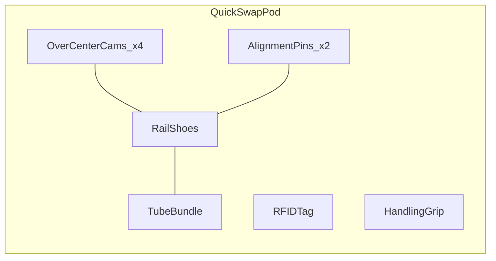

# MKFS Quick-Swap Pod Mechanism

**Document ID:** MKFS-PROTO-POD-001  
**Version:** 0.1 (Phase 2)  
**Interface:** MKFS-POD-QUICKSWAP / MKFS-IF-002  
**Related:** [ARRAY_MODULE_SPEC.md](ARRAY_MODULE_SPEC.md)

---

## 1. Overview

The quick-swap pod is a pre-loaded tube bundle that slides into the array module on rails and locks with four over-center cams. Swap target: **< 5 minutes with 2 crew, no tools**.

---

## 2. Pod Assembly

| Component | Material | Mass |
|-----------|----------|------|
| Tube bundle (25×) | Steel tubes + aluminum frame | 38 kg |
| Rail shoes | Hard-anodized Al | 2 kg |
| Cams + linkage | Stainless steel | 1.5 kg |
| RFID tag | — | 0.05 kg |
| **Total (standard pod)** | | **~45 kg** |

---

## 3. Mechanical Interface

### 3.1 Rail System

| Parameter | Value |
|-----------|-------|
| Rail type | Dual dovetail, 20 mm width |
| Insert depth | 280 mm |
| Insert angle | 15° nose-up slide-in |
| Retention | 4× over-center cam (hand lever, 90° throw) |
| Alignment pins | 2× 12 mm hardened, 30 mm engagement |

### 3.2 Cam Lock Detail

| Step | Action | Force |
|------|--------|-------|
| Unlock | Rotate cam lever aft 90° | ≤ 25 N hand force |
| Slide out | Pull pod aft on rails 300 mm | ≤ 150 N |
| Slide in | Align pins → push forward | ≤ 200 N |
| Lock | Rotate cam lever forward 90° | Audible click + FCU confirm |

Cam over-center geometry prevents vibration-induced release. Secondary spring detent holds cam in locked position.

### 3.3 Interlock

| Condition | FCU Response |
|-----------|--------------|
| Any cam unlocked | `POD_LATCH_OPEN` → tubes de-energized |
| All cams locked + RFID read | `POD_READY` |
| Pod removed mid-arm | Transition to RELOAD state |

---

## 4. Swap Procedure (Standard Pod)

| Step | Time (s) | Crew | Action |
|------|----------|------|--------|
| 1 | 15 | FCU operator | FCU → SAFE; confirm tubes cold |
| 2 | 30 | Crew 1+2 | Unlock 4 cams; verify de-energize LED |
| 3 | 45 | Crew 1+2 | Slide spent pod aft; place on dolly |
| 4 | 60 | Crew 1+2 | Inspect rails; wipe if needed |
| 5 | 90 | Crew 1+2 | Align fresh pod; slide in until pins seat |
| 6 | 120 | Crew 1+2 | Lock 4 cams; verify tactile click |
| 7 | 150 | FCU operator | FCU scan RFID; confirm 25/25 tube map |
| 8 | 180 | FCU operator | FCU → ARMED (if mission ready) |

**Total: ~3 min** (margin to 5 min target under field conditions)

---

## 5. Band Index Verification

Pre-load checklist (before pod insertion):

| Check | Method |
|-------|--------|
| Band index visible | Color ring on case head (short=red, standard=yellow, long=green) |
| All rounds same index | Visual scan of tube tops |
| RFID logs index | Pod tag encodes band index + lot number |

Mismatch (mixed band indices in one pod) → FCU warning; fire blocked until corrected.

---

## 6. Tier Variants

| Tier | Pod ID | Mass | Rail spacing | Cam count |
|------|--------|------|--------------|-----------|
| Compact (16) | `MKFS-POD-C16` | 35 kg | Same | 4 |
| Standard (25) | `MKFS-POD-S25` | 45 kg | Same | 4 |
| Dense (36) | `MKFS-POD-D36` | 55 kg | Extended rails (+40 mm) | 4 |

All tiers use identical cam and pin interface to array module.

---

## 7. Prototype Test Plan

| Test | Pass Criteria |
|------|---------------|
| 500 insert/remove cycles | Cam wear ≤ 0.1 mm; lock force unchanged |
| Vibration (MIL-STD-810) | No cam walk-off |
| Swap time (10 trials, 2 crew) | Mean < 4 min; max < 5 min |
| Interlock | Zero primer voltage with cam open |

---

## 8. Revision History

| Version | Date | Change |
|---------|------|--------|
| 0.1 | 2026-05-22 | Phase 2 pod mechanism spec |
