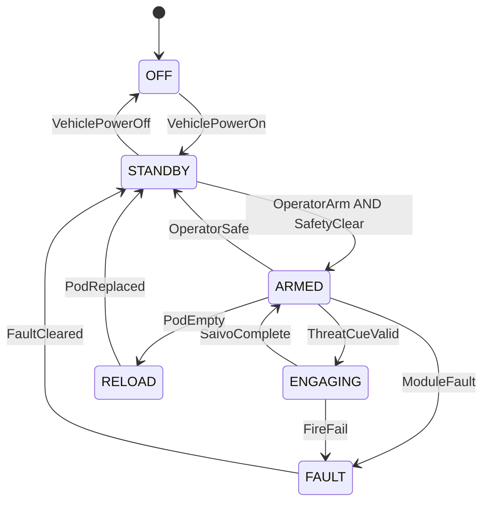

# MKFS Fire Control Unit — State Machine Specification

**Document ID:** MKFS-SW-FCU-001  
**Version:** 0.1 (Phase 2)  
**Related:** [SYSTEM_ARCHITECTURE.md](../../docs/architecture/SYSTEM_ARCHITECTURE.md) | [REQUIREMENTS.md](../../docs/REQUIREMENTS.md) FR-009

---

## 1. Purpose

Define FCU operational states, transitions, and salvo control logic. FCU runs on vehicle 28 VDC; communicates with array modules via MKFS-IF-004 (CAN bus recommended — see D-003).

---

## 2. State Diagram



---

## 3. State Definitions

| State | Description | Module Power | Fire Enabled |
|-------|-------------|--------------|--------------|
| OFF | No power | Off | No |
| STANDBY | Powered, monitoring | Idle (25 W) | No |
| ARMED | Ready to engage | Active (80 W) | Yes |
| ENGAGING | Salvo in progress | Peak (150 W/module) | Yes |
| RELOAD | Pod empty or swap required | Idle | No |
| FAULT | Error condition | Safe | No |

---

## 4. Safety Interlocks

| ID | Condition | Action |
|----|-----------|--------|
| SI-001 | Vehicle speed > 5 kph (configurable) | Block ARMED unless override |
| SI-002 | Friendly zone inhibit (GPS + turret aspect) | Block tubes in inhibit arc |
| SI-003 | Module elevation < -5° or > +60° | Block fire |
| SI-004 | Pod removed / latch open | De-energize tubes → FAULT |
| SI-005 | No threat cue for 30 s in ENGAGING | Return to ARMED |

---

## 5. Salvo Control Logic

```
INPUT:  threat_track (azimuth, elevation, range)
        module_status (tube_map, pod_count, band_index)
        salvo_profile (size, inter_tube_ms, spread_pattern)

COMPUTE:
  1. Select module(s) covering threat azimuth
  2. Compute elevation offset for R_band center (350 ft nominal)
  3. Select tube subset (full fan or focused cone)
  4. Apply V0 temperature compensation (elevation trim)

OUTPUT: fire_queue[tube_id, delay_ms]
        max 25 tubes per module per salvo
```

### Salvo Profiles (Presets)

| Profile | Tubes | Inter-tube Delay | Use Case |
|---------|-------|------------------|----------|
| **LAST_DITCH_FULL** | **All addressed** | **0–5 ms** | **Swarm on you — dump everything NOW** |
| SWARM_WIDE | All on selected tile(s) | 10 ms | Broad coverage |
| SWARM_FOCUS | Sector mask | 10 ms | Concentrated cone |
| SWARM_BURST | Half or full tile | 5 ms | High density |
| SECTOR_LEFT / SECTOR_RIGHT | Address mask | 10 ms | Friendly side clear |
| HOLD | 0 | — | Safe |

---

## 6. CAN Message Map (D-003 Recommendation)

**Recommendation:** CAN 2.0B at 500 kbps — adopt for MKFS-IF-004 Phase 2 revision.

| Msg ID | Direction | Content |
|--------|-----------|---------|
| 0x100 | FCU → Module | Fire command (tube mask, delays) |
| 0x101 | FCU → Module | Elevation/azimuth setpoint |
| 0x200 | Module → FCU | Status (ready, fault, pod count) |
| 0x201 | Module → FCU | Last salvo report |

---

## 7. Implementation Path

| Phase | Deliverable |
|-------|-------------|
| 2 | State machine spec (this doc) + stub in `src/fire_control/` |
| 2 | Hardware-in-loop simulator |
| 3 | Vehicle bus integration |
| 4 | Qualification test |

---

## 8. Revision History

| Version | Date | Change |
|---------|------|--------|
| 0.1 | 2026-05-22 | Initial FCU state machine; CAN recommended |
