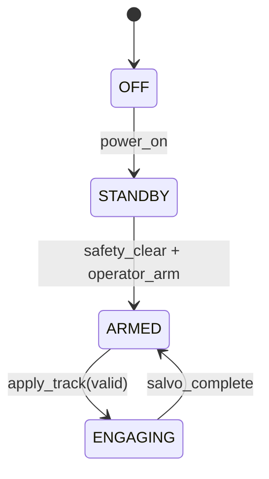

# MKFS FCU Hardware-in-Loop Simulator

**Document ID:** MKFS-FCU-HIL-001  
**Version:** 0.1 (Phase 8)  
**Related:** [FCU_STATE_MACHINE.md](FCU_STATE_MACHINE.md) | [hil_sim.py](hil_sim.py) | [test_hil_sim.py](test_hil_sim.py)

---

## 1. Purpose

Minimal HIL stub: **track cue in → fire queue out** for one engagement vignette. Validates FCU state transitions OFF → STANDBY → ARMED → ENGAGING → ARMED without hardware.

---

## 2. Vignette Flow



1. `power_on_and_arm()` — safety clear, operator arm  
2. `apply_track(valid=True)` — threat cue → ENGAGING  
3. `engage_strip(136)` — `build_fire_queue` @ 2 ms inter-tube  
4. `salvo_complete()` — return to ARMED  

---

## 3. API

| Method | Returns |
|--------|---------|
| `run_vignette(tube_count=136)` | `{final_state, queue_len, first_tube, last_delay_ms}` |
| `apply_track(valid, stale_ms=0)` | FCU state; stale > 500 ms ignored |

---

## 4. Usage

```bash
cd src/fire_control
python -m pytest test_hil_sim.py -q
```

---

## 5. Revision History

| Version | Date | Change |
|---------|------|--------|
| 0.1 | 2026-05-22 | Phase 8 minimal HIL stub |
